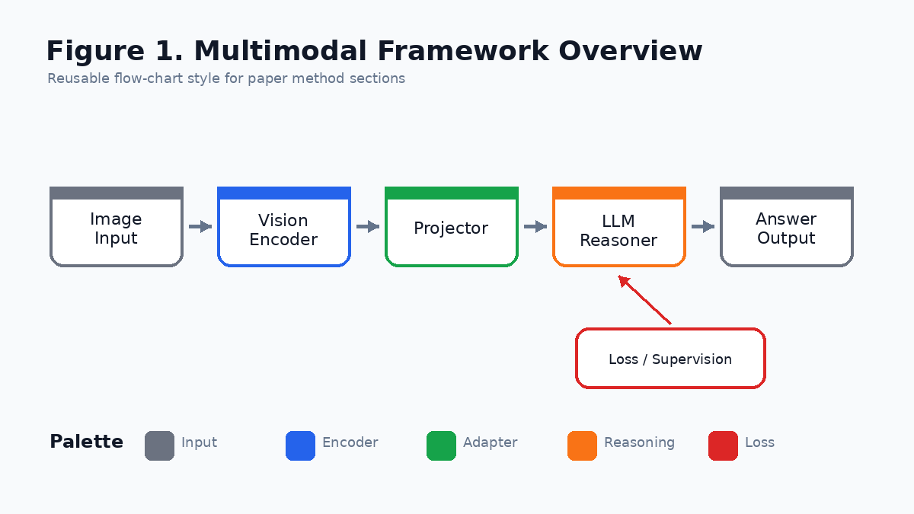
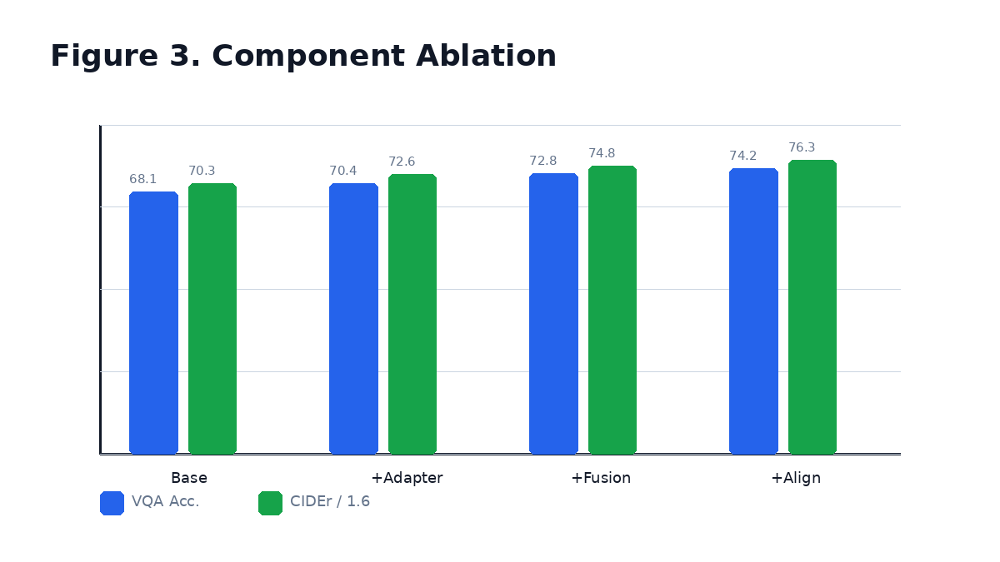
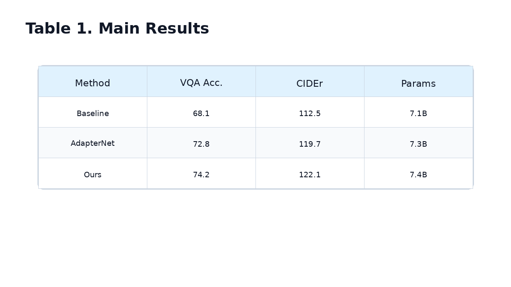
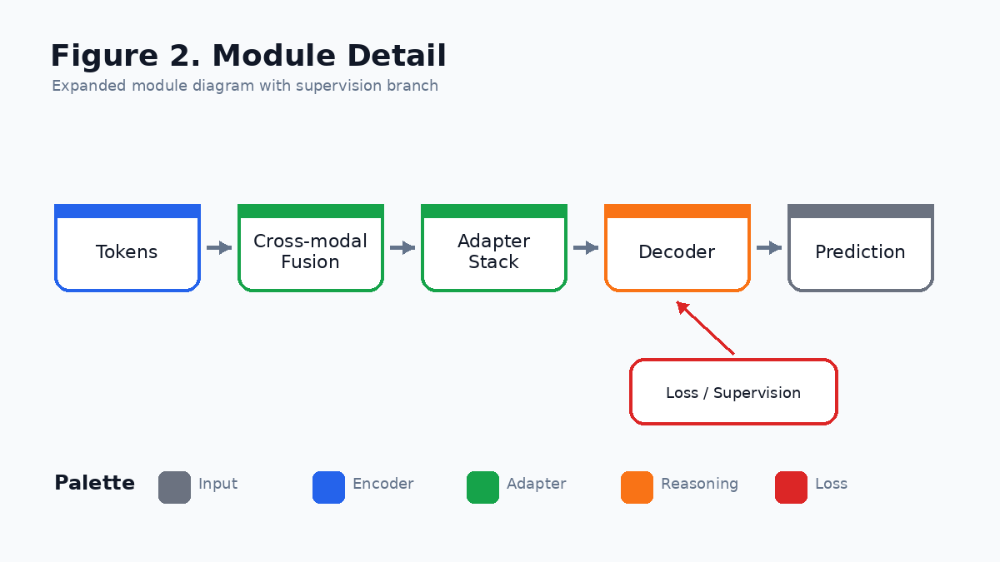
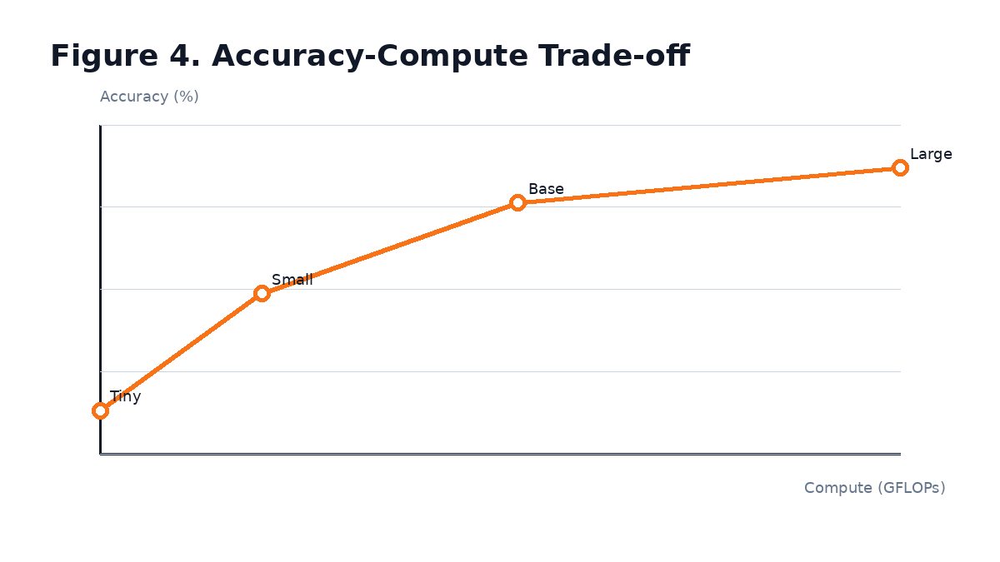
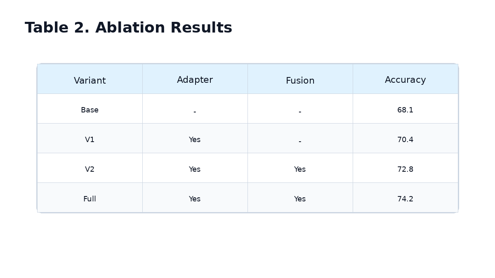

[Back to Home](../../README.md)

# Example Multimodal Framework

## Paper Information

| Field | Value |
|---|---|
| Title | Example Multimodal Framework |
| Venue | CVPR |
| Year | 2024 |
| Topic | Multimodal learning, visual-language reasoning, modular adapters |
| Paper | Placeholder paper link |
| Code | Placeholder code link |
| Project Page | Placeholder project page |
| Asset Type | Method figures, result analysis figures, paper tables |

## Asset Preview Gallery

| Method Figures | Result Figures | Table Figures |
|---|---|---|
|  |  |  |
|  |  |  |

# 1. Method Figures

## Figure 1: Framework Overview


| Asset | Link |
|---|---|
| Preview Image | [fig1_overview.png](method_figures/fig1_overview.png) |
| PPT Source | [fig1_overview.pptx](method_figures/fig1_overview.pptx) |

### Color Palette

| Role | Swatch | Color | Hex |
|---|---|---|---|
| Input / context |  | Gray | `#6B7280` |
| Vision encoder |  | Blue | `#2563EB` |
| Projector / adapter |  | Green | `#16A34A` |
| LLM / reasoning |  | Orange | `#F97316` |
| Supervision signal |  | Red | `#DC2626` |

### Design Notes

- Blue: perception, encoder, backbone
- Orange: LLM, decoder, reasoning module
- Green: adapter, projector, transformation module
- Red: loss, supervision, optimization signal
- Gray: input, frozen module, auxiliary background

## Figure 2: Module Detail


| Asset | Link |
|---|---|
| Preview Image | [fig2_module_detail.png](method_figures/fig2_module_detail.png) |
| PPT Source | [fig2_module_detail.pptx](method_figures/fig2_module_detail.pptx) |

### Color Palette

| Role | Swatch | Color | Hex |
|---|---|---|---|
| Feature tokens |  | Blue | `#3B82F6` |
| Fusion block |  | Green | `#22C55E` |
| Reasoning block |  | Orange | `#EA580C` |
| Loss head |  | Red | `#EF4444` |
| Frozen branch |  | Gray | `#9CA3AF` |

### Design Notes

- Blue: perception, encoder, backbone
- Orange: LLM, decoder, reasoning module
- Green: adapter, projector, transformation module
- Red: loss, supervision, optimization signal
- Gray: input, frozen module, auxiliary background

# 2. Result Analysis Figures

## Figure 3: Ablation Study


| Asset | Link |
|---|---|
| Preview Image | [fig3_ablation.png](result_figures/fig3_ablation.png) |

### Plotting Code

```python
import matplotlib.pyplot as plt
import numpy as np

methods = ["Base", "+Adapter", "+Fusion", "+Align"]
vqa = [68.1, 70.4, 72.8, 74.2]
caption = [112.5, 116.2, 119.7, 122.1]

x = np.arange(len(methods))
width = 0.36

fig, ax1 = plt.subplots(figsize=(7, 4))
ax1.bar(x - width / 2, vqa, width, label="VQA Acc.", color="#2563EB")
ax1.set_ylabel("VQA Accuracy (%)")
ax1.set_ylim(64, 78)

ax2 = ax1.twinx()
ax2.bar(x + width / 2, caption, width, label="CIDEr", color="#16A34A")
ax2.set_ylabel("CIDEr")
ax2.set_ylim(105, 126)

ax1.set_xticks(x)
ax1.set_xticklabels(methods)
ax1.grid(axis="y", linestyle="--", alpha=0.25)

handles1, labels1 = ax1.get_legend_handles_labels()
handles2, labels2 = ax2.get_legend_handles_labels()
ax1.legend(handles1 + handles2, labels1 + labels2, loc="upper left")

plt.title("Component Ablation")
plt.tight_layout()
plt.show()
```

## Figure 4: Accuracy-Compute Trade-off


| Asset | Link |
|---|---|
| Preview Image | [fig4_tradeoff.png](result_figures/fig4_tradeoff.png) |

### Plotting Code

```python
import matplotlib.pyplot as plt

models = ["Tiny", "Small", "Base", "Large"]
flops = [42, 78, 135, 220]
accuracy = [69.4, 72.1, 74.2, 75.0]

plt.figure(figsize=(6.5, 4))
plt.plot(flops, accuracy, marker="o", linewidth=2.5, color="#F97316")
for name, x, y in zip(models, flops, accuracy):
    plt.text(x + 3, y + 0.05, name, fontsize=9)

plt.xlabel("Compute (GFLOPs)")
plt.ylabel("Accuracy (%)")
plt.title("Accuracy-Compute Trade-off")
plt.grid(True, linestyle="--", alpha=0.3)
plt.tight_layout()
plt.show()
```

# 3. Paper Tables

## Table 1: Main Results


| Asset | Link |
|---|---|
| Preview Image | [table1_main_results.png](tables/table1_main_results.png) |

### LaTeX Source

```latex
\begin{table}[t]
\centering
\caption{Main results on multimodal benchmarks.}
\label{tab:main-results}
\begin{tabular}{lccc}
\toprule
Method & VQA Acc. & CIDEr & Params \\
\midrule
Baseline & 68.1 & 112.5 & 7.1B \\
AdapterNet & 72.8 & 119.7 & 7.3B \\
Ours & \textbf{74.2} & \textbf{122.1} & 7.4B \\
\bottomrule
\end{tabular}
\end{table}
```

### Required Packages

```latex
\usepackage{booktabs}
```

## Table 2: Ablation Results


| Asset | Link |
|---|---|
| Preview Image | [table2_ablation.png](tables/table2_ablation.png) |

### LaTeX Source

```latex
\begin{table}[t]
\centering
\caption{Ablation study for key modules.}
\label{tab:ablation}
\begin{tabular}{lccc}
\toprule
Variant & Adapter & Fusion & Accuracy \\
\midrule
Base & -- & -- & 68.1 \\
V1 & \checkmark & -- & 70.4 \\
V2 & \checkmark & \checkmark & 72.8 \\
Full & \checkmark & \checkmark & \textbf{74.2} \\
\bottomrule
\end{tabular}
\end{table}
```

### Required Packages

```latex
\usepackage{booktabs}
\usepackage{amssymb}
```
