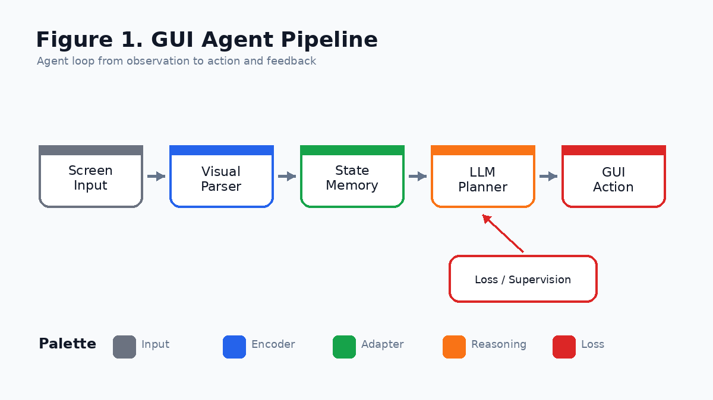
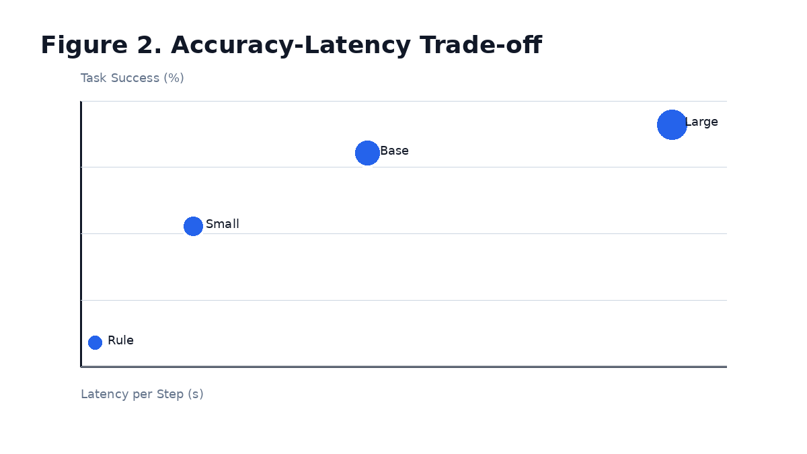
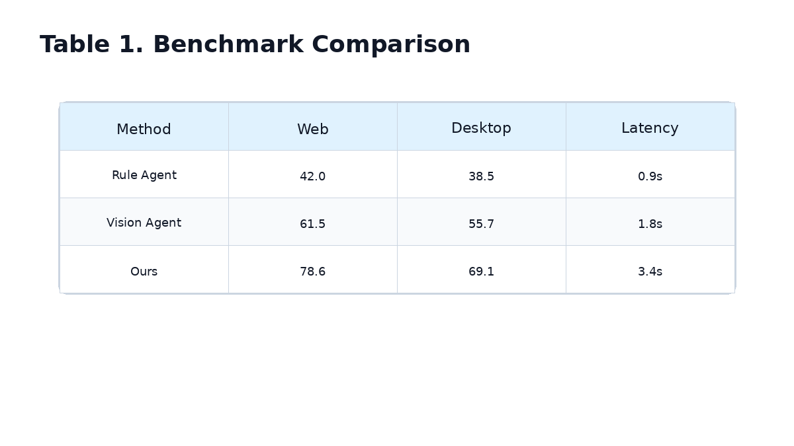
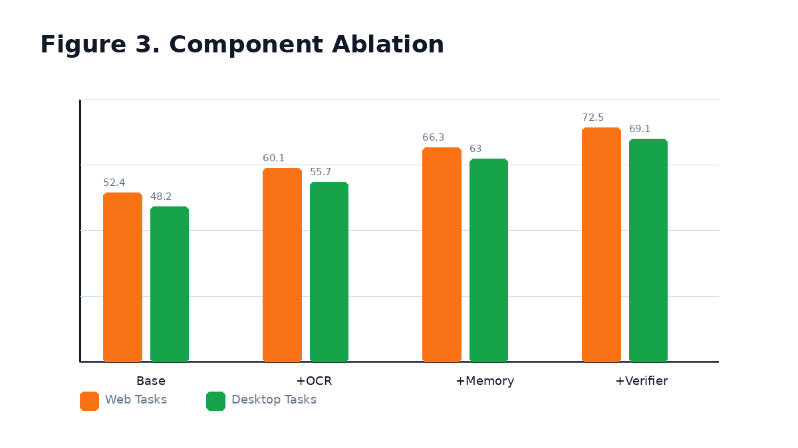

[Back to Home](../../README.md)

# Example GUI Agent

## Paper Information

| Field | Value |
|---|---|
| Title | Example GUI Agent |
| Venue | ICLR |
| Year | 2025 |
| Topic | GUI automation, multimodal agents, action planning |
| Paper | Placeholder paper link |
| Code | Placeholder code link |
| Project Page | Placeholder project page |
| Asset Type | Method figures, result analysis figures, paper tables |

## Asset Preview Gallery

| Method Figures | Result Figures | Table Figures |
|---|---|---|
|  |  |  |
|  |  |  |

# 1. Method Figures

## Figure 1: Agent Pipeline


| Asset | Link |
|---|---|
| Preview Image | [fig1_agent_pipeline.png](method_figures/fig1_agent_pipeline.png) |
| PPT Source | [fig1_agent_pipeline.pptx](method_figures/fig1_agent_pipeline.pptx) |

### Color Palette

| Role | Swatch | Color | Hex |
|---|---|---|---|
| Screenshot input | <sub><sup>#6B7280</sup></sub> | Gray | `#6B7280` |
| Visual parser | <sub><sup>#2563EB</sup></sub> | Blue | `#2563EB` |
| Planner memory | <sub><sup>#16A34A</sup></sub> | Green | `#16A34A` |
| LLM policy | <sub><sup>#F97316</sup></sub> | Orange | `#F97316` |
| Action feedback | <sub><sup>#DC2626</sup></sub> | Red | `#DC2626` |

### Design Notes

- Blue: perception, encoder, backbone
- Orange: LLM, decoder, reasoning module
- Green: adapter, projector, transformation module
- Red: loss, supervision, optimization signal
- Gray: input, frozen module, auxiliary background

# 2. Result Analysis Figures

## Figure 2: Accuracy-Latency Trade-off


| Asset | Link |
|---|---|
| Preview Image | [fig2_accuracy_latency.png](result_figures/fig2_accuracy_latency.png) |

### Plotting Code

```python
import matplotlib.pyplot as plt

systems = ["Rule", "Small Agent", "Base Agent", "Large Agent"]
latency = [0.9, 1.8, 3.4, 6.2]
success = [42.0, 61.5, 73.8, 78.6]

plt.figure(figsize=(6.5, 4))
plt.scatter(latency, success, s=[80, 120, 160, 220], color="#2563EB", alpha=0.85)
for name, x, y in zip(systems, latency, success):
    plt.text(x + 0.08, y + 0.4, name, fontsize=9)

plt.xlabel("Latency per Step (s)")
plt.ylabel("Task Success (%)")
plt.title("GUI Agent Accuracy-Latency Trade-off")
plt.grid(True, linestyle="--", alpha=0.3)
plt.tight_layout()
plt.show()
```

## Figure 3: Component Ablation


| Asset | Link |
|---|---|
| Preview Image | [fig3_component_ablation.png](result_figures/fig3_component_ablation.png) |

### Plotting Code

```python
import matplotlib.pyplot as plt
import numpy as np

components = ["Base", "+OCR", "+Memory", "+Verifier"]
web = [52.4, 60.1, 66.3, 72.5]
desktop = [48.2, 55.7, 63.0, 69.1]

x = np.arange(len(components))
width = 0.36

plt.figure(figsize=(7, 4))
plt.bar(x - width / 2, web, width, label="Web Tasks", color="#F97316")
plt.bar(x + width / 2, desktop, width, label="Desktop Tasks", color="#16A34A")
plt.xticks(x, components)
plt.ylabel("Success Rate (%)")
plt.title("Agent Component Ablation")
plt.ylim(40, 78)
plt.grid(axis="y", linestyle="--", alpha=0.25)
plt.legend()
plt.tight_layout()
plt.show()
```

# 3. Paper Tables

## Table 1: Benchmark Comparison


| Asset | Link |
|---|---|
| Preview Image | [table1_benchmark_comparison.png](tables/table1_benchmark_comparison.png) |

### LaTeX Source

```latex
\begin{table}[t]
\centering
\caption{Benchmark comparison on GUI tasks.}
\label{tab:gui-benchmark}
\begin{tabular}{lccc}
\toprule
Method & Web & Desktop & Avg. Latency \\
\midrule
Rule Agent & 42.0 & 38.5 & 0.9s \\
Vision Agent & 61.5 & 55.7 & 1.8s \\
Ours & \textbf{78.6} & \textbf{69.1} & 3.4s \\
\bottomrule
\end{tabular}
\end{table}
```

### Required Packages

```latex
\usepackage{booktabs}
```
