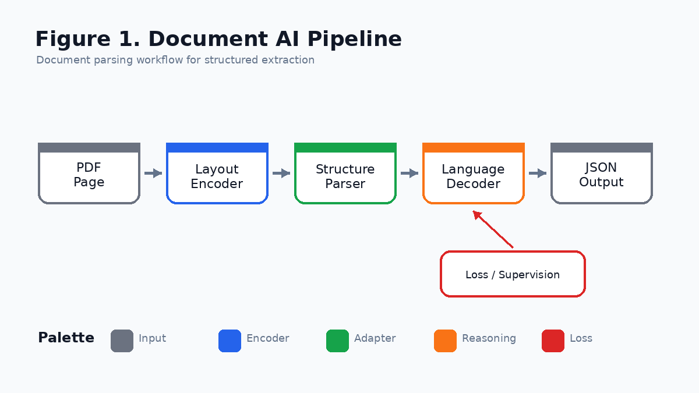
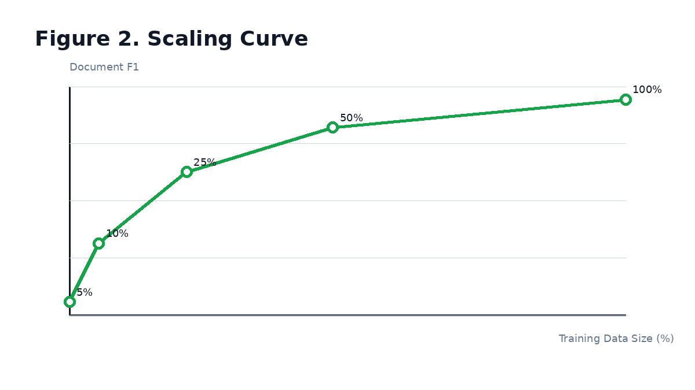
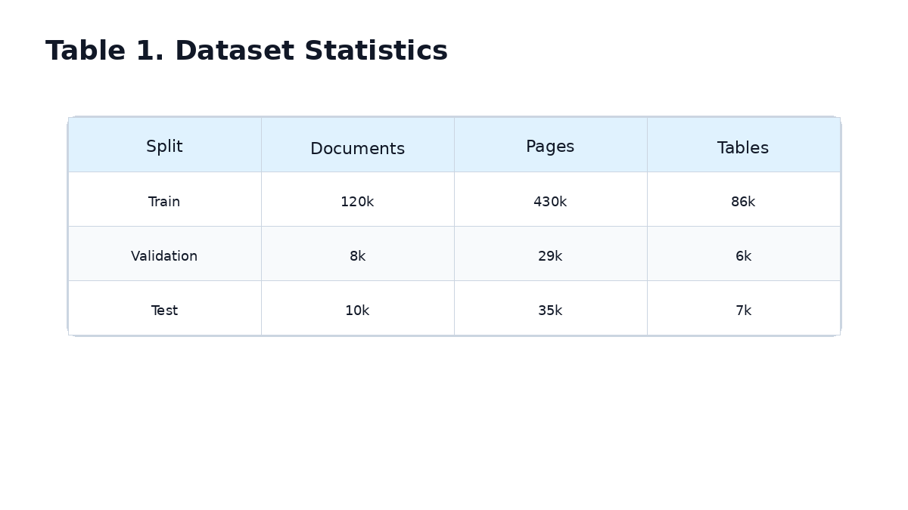
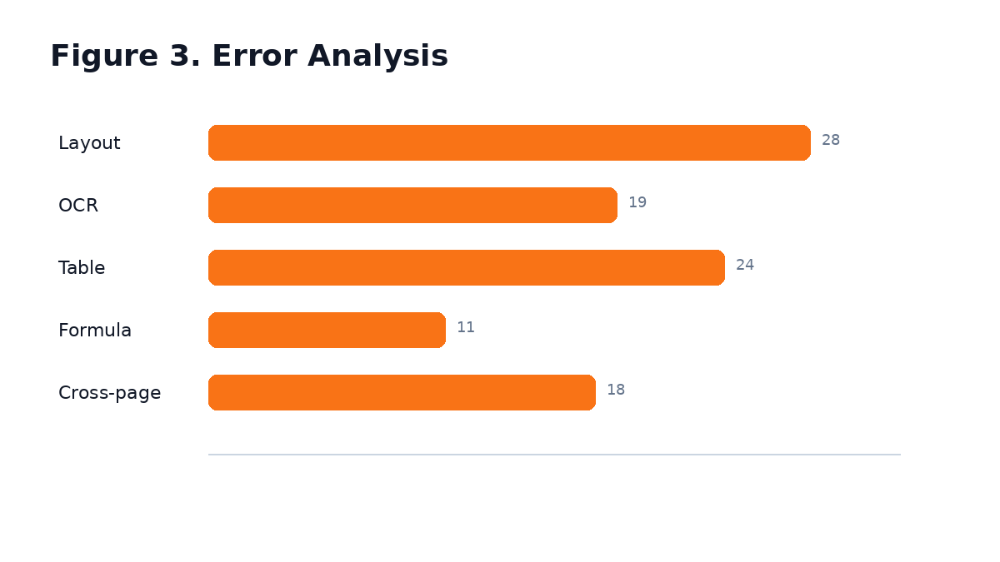

[Back to Home](../../README.md)

# Example Document AI System

## Paper Information

| Field | Value |
|---|---|
| Title | Example Document AI System |
| Venue | NeurIPS |
| Year | 2025 |
| Topic | Document understanding, layout analysis, structured extraction |
| Paper | Placeholder paper link |
| Code | Placeholder code link |
| Project Page | Placeholder project page |
| Asset Type | Method figures, result analysis figures, paper tables |

## Asset Preview Gallery

| Method Figures | Result Figures | Table Figures |
|---|---|---|
|  |  |  |
|  |  |  |

# 1. Method Figures

## Figure 1: Document Pipeline


| Asset | Link |
|---|---|
| Preview Image | [fig1_document_pipeline.png](method_figures/fig1_document_pipeline.png) |
| PPT Source | [fig1_document_pipeline.pptx](method_figures/fig1_document_pipeline.pptx) |

### Color Palette

| Role | Swatch | Color | Hex |
|---|---|---|---|
| Document input |  | Gray | `#6B7280` |
| Layout encoder |  | Blue | `#2563EB` |
| Structure parser |  | Green | `#16A34A` |
| Language decoder |  | Orange | `#F97316` |
| Extraction loss |  | Red | `#DC2626` |

### Design Notes

- Blue: perception, encoder, backbone
- Orange: LLM, decoder, reasoning module
- Green: adapter, projector, transformation module
- Red: loss, supervision, optimization signal
- Gray: input, frozen module, auxiliary background

# 2. Result Analysis Figures

## Figure 2: Scaling Curve


| Asset | Link |
|---|---|
| Preview Image | [fig2_scaling_curve.png](result_figures/fig2_scaling_curve.png) |

### Plotting Code

```python
import matplotlib.pyplot as plt

data_size = [5, 10, 25, 50, 100]
f1_score = [71.2, 75.8, 81.4, 84.9, 87.1]

plt.figure(figsize=(6.5, 4))
plt.plot(data_size, f1_score, marker="o", linewidth=2.5, color="#16A34A")
plt.xscale("log")
plt.xlabel("Training Data Size (%)")
plt.ylabel("Document F1")
plt.title("Scaling Curve")
plt.grid(True, which="both", linestyle="--", alpha=0.3)
plt.tight_layout()
plt.show()
```

## Figure 3: Error Analysis


| Asset | Link |
|---|---|
| Preview Image | [fig3_error_analysis.png](result_figures/fig3_error_analysis.png) |

### Plotting Code

```python
import matplotlib.pyplot as plt

error_types = ["Layout", "OCR", "Table", "Formula", "Cross-page"]
counts = [28, 19, 24, 11, 18]

plt.figure(figsize=(6.5, 4))
plt.barh(error_types, counts, color="#F97316")
plt.xlabel("Error Count")
plt.title("Document Extraction Error Analysis")
plt.grid(axis="x", linestyle="--", alpha=0.3)
plt.tight_layout()
plt.show()
```

# 3. Paper Tables

## Table 1: Dataset Statistics


| Asset | Link |
|---|---|
| Preview Image | [table1_dataset_statistics.png](tables/table1_dataset_statistics.png) |

### LaTeX Source

```latex
\begin{table}[t]
\centering
\caption{Dataset statistics for document understanding.}
\label{tab:dataset-statistics}
\begin{tabular}{lccc}
\toprule
Split & Documents & Pages & Tables \\
\midrule
Train & 120k & 430k & 86k \\
Validation & 8k & 29k & 6k \\
Test & 10k & 35k & 7k \\
\bottomrule
\end{tabular}
\end{table}
```

### Required Packages

```latex
\usepackage{booktabs}
```
