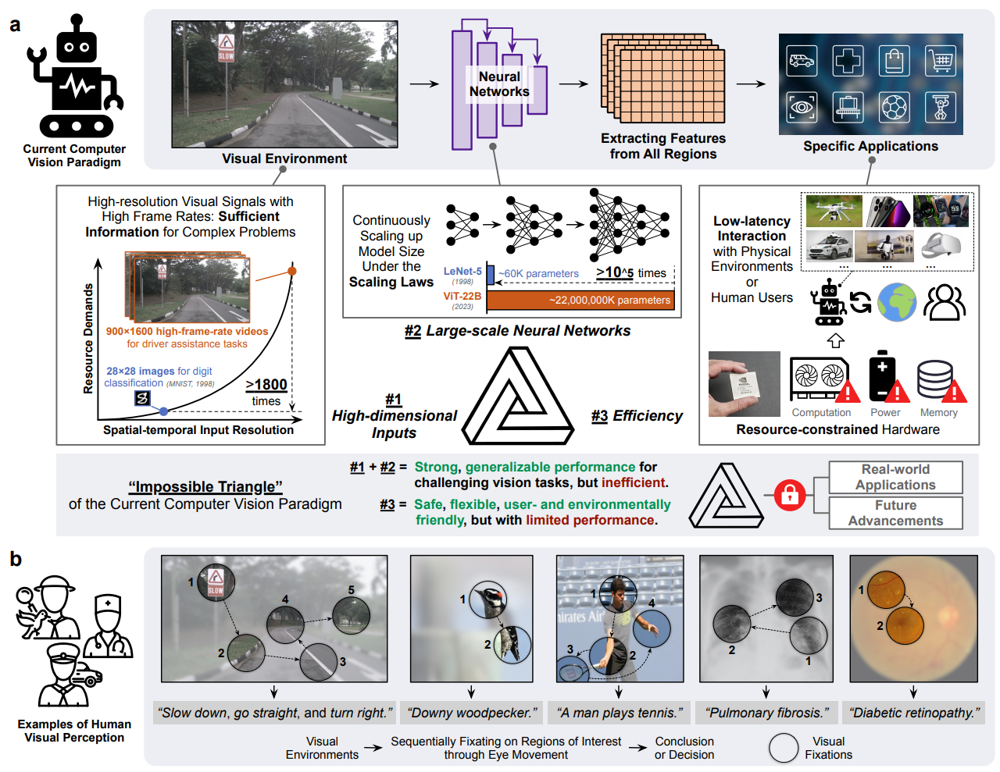
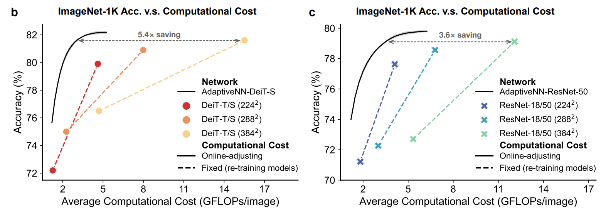
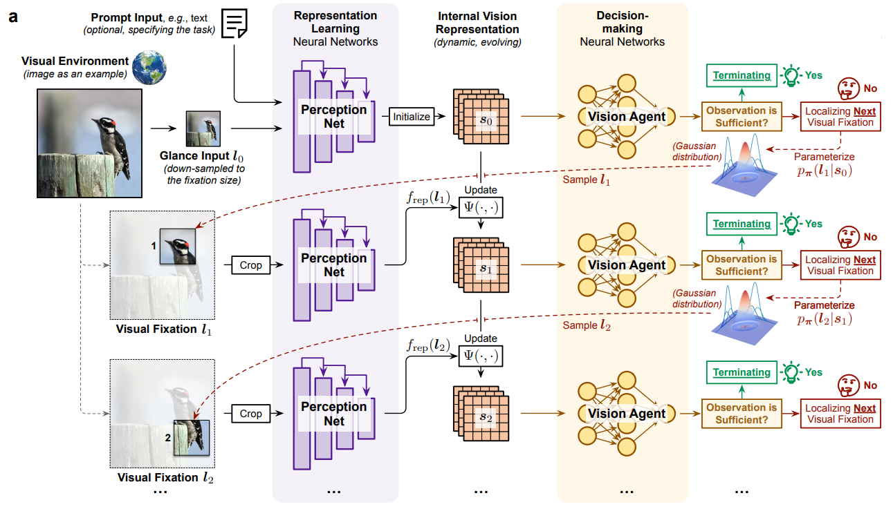
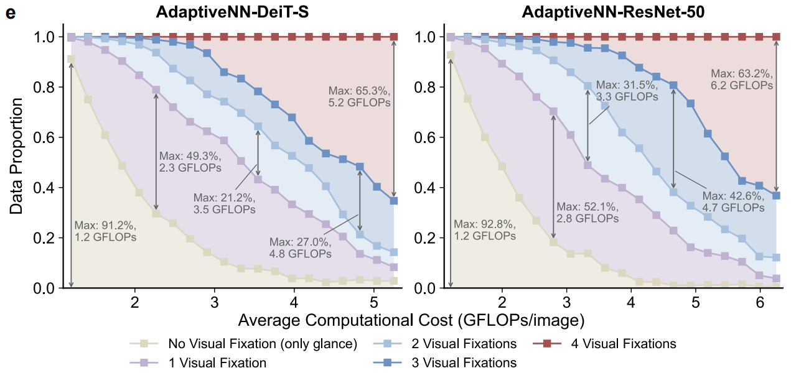
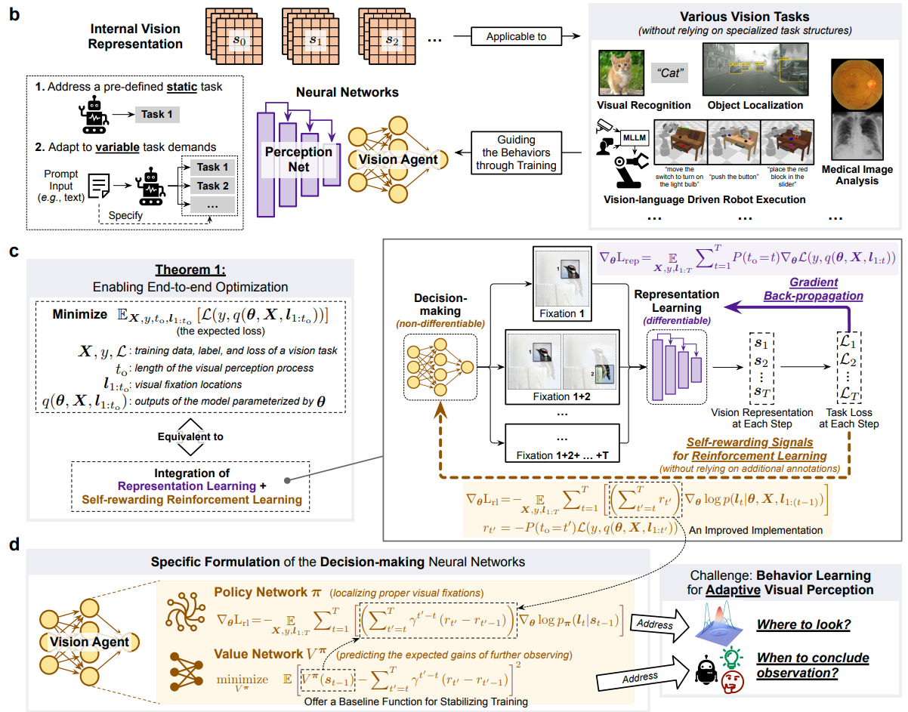
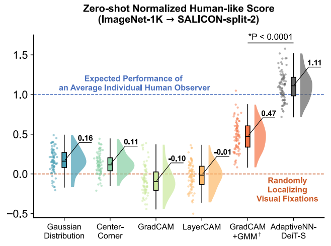

<div align="right">

[← Back to Home](../../README.md)

</div>

<h1 align="center">Emulating Human-like Adaptive Vision for Efficient and Flexible Machine Visual Perception</h1>

---

## Paper Information

| Field | Value |
|---|---|
| Title | Emulating Human-like Adaptive Vision for Efficient and Flexible Machine Visual Perception |
| Venue | Nature Machine Intelligence |
| Year | 2025 |
| Topic | Adaptive visual perception, sequential fixation policies, efficient and interpretable computer vision |
| Paper | [arXiv:2509.15333](https://arxiv.org/abs/2509.15333) |
| Code | [LeapLabTHU/AdaptiveNN](https://github.com/LeapLabTHU/AdaptiveNN) |
| Asset Type | Method figures, result analysis figures |

---

## Asset Preview Gallery

<table>
  <tr>
    <th>Method Figures</th>
    <th>Result Figures</th>
    <th>Table Figures</th>
  </tr>
  <tr>
    <td align="center">
      <br>
      <sub>Adaptive Vision Motivation and Impossible Triangle</sub>
    </td>
    <td align="center">
      <br>
      <sub>ImageNet Accuracy and Computational Cost Trade-off</sub>
    </td>
    <td align="center">
      <sub>No table figures provided</sub>
    </td>
  </tr>
  <tr>
    <td align="center">
      <br>
      <sub>AdaptiveNN Sequential Fixation Pipeline</sub>
    </td>
    <td align="center">
      <br>
      <sub>Budget-dependent Visual Fixation Allocation</sub>
    </td>
    <td align="center">
    </td>
  </tr>
  <tr>
    <td align="center">
      <br>
      <sub>AdaptiveNN Task Generality and Training Objective</sub>
    </td>
    <td align="center">
      <br>
      <sub>Human-like Fixation Alignment on SALICON</sub>
    </td>
    <td align="center">
    </td>
  </tr>
</table>

---

# 1. Method Figures

## Figure 1: Adaptive Vision Motivation and Impossible Triangle

<p align="center">
  
</p>

| Asset | Link |
|---|---|
| Preview Image | [image1.png](method_figures/image1.png) |
| PPT Source | Not available |

### Color Palette

| Role | Swatch | Color | Hex |
|---|---|---|---|
| Current passive vision paradigm |  | Black | `#111111` |
| Large-scale neural networks |  | Purple | `#6A3FB2` |
| Dense feature extraction grid |  | Orange | `#F2B88E` |
| Resource and efficiency warnings |  | Red | `#E53935` |
| Adaptive performance benefit |  | Green | `#00A862` |

---

## Figure 2: AdaptiveNN Sequential Fixation Pipeline

<p align="center">
  
</p>

| Asset | Link |
|---|---|
| Preview Image | [image2.png](method_figures/image2.png) |
| PPT Source | Not available |

### Color Palette

| Role | Swatch | Color | Hex |
|---|---|---|---|
| Perception network modules |  | Purple | `#6A3FB2` |
| Internal vision representation |  | Orange | `#F2B88E` |
| Vision agent and decision policy |  | Brown | `#B66A00` |
| Termination decision |  | Green | `#009B62` |
| Next-fixation localization |  | Red | `#C21807` |

---

## Figure 3: AdaptiveNN Task Generality and Training Objective

<p align="center">
  
</p>

| Asset | Link |
|---|---|
| Preview Image | [image3.png](method_figures/image3.png) |
| PPT Source | Not available |

### Color Palette

| Role | Swatch | Color | Hex |
|---|---|---|---|
| Shared internal representation |  | Orange | `#F2B88E` |
| Perception network |  | Purple | `#6A3FB2` |
| Vision agent policy and value networks |  | Brown | `#B66A00` |
| Representation-learning gradients |  | Purple | `#7B2CBF` |
| Self-rewarding reinforcement signal |  | Brown | `#A66100` |

---

# 2. Result Analysis Figures

## Figure 4: ImageNet Accuracy and Computational Cost Trade-off

<p align="center">
  
</p>

| Asset | Link |
|---|---|
| Preview Image | [image1.png](result_figures/image1.png) |

### Plotting Code

Note: The following code is an approximate visual reconstruction based on the provided figure.

```python
import matplotlib.pyplot as plt
import numpy as np

fig, axes = plt.subplots(1, 2, figsize=(13.2, 4.6), dpi=120)
plt.rcParams.update({"font.size": 13, "font.family": "DejaVu Sans"})

panels = [
    {
        "label": "b",
        "title": "ImageNet-1K Acc. v.s. Computational Cost",
        "adaptive": "AdaptiveNN-DeiT-S",
        "fixed": "DeiT-T/S",
        "marker": "o",
        "colors": ["#D73035", "#F28C55", "#F5CD82"],
        "fixed_points": [(1.25, 72.2), (4.60, 79.9), (2.20, 75.0), (7.95, 80.9), (4.70, 76.5), (15.50, 81.6)],
        "line_groups": [(0, 1), (2, 3), (4, 5)],
        "curve_x": np.array([1.2, 1.5, 1.8, 2.2, 2.8, 3.7, 5.2]),
        "curve_y": np.array([75.6, 78.0, 80.0, 81.0, 81.8, 82.1, 82.2]),
        "ylim": (71.5, 82.8),
        "yticks": [72, 74, 76, 78, 80, 82],
        "saving_text": "5.4x saving",
        "saving_y": 81.6,
        "saving_x": (3.0, 15.3),
    },
    {
        "label": "c",
        "title": "ImageNet-1K Acc. v.s. Computational Cost",
        "adaptive": "AdaptiveNN-ResNet-50",
        "fixed": "ResNet-18/50",
        "marker": "X",
        "colors": ["#4E63B6", "#46A1B6", "#7CCB9D"],
        "fixed_points": [(1.80, 71.2), (3.40, 77.7), (2.80, 72.3), (6.75, 78.6), (5.40, 72.7), (11.90, 79.2)],
        "line_groups": [(0, 1), (2, 3), (4, 5)],
        "curve_x": np.array([1.2, 1.5, 1.9, 2.4, 3.0, 3.9, 5.0, 6.2]),
        "curve_y": np.array([74.0, 76.0, 77.3, 78.2, 78.9, 79.4, 79.7, 79.8]),
        "ylim": (70.0, 80.3),
        "yticks": [70, 72, 74, 76, 78, 80],
        "saving_text": "3.6x saving",
        "saving_y": 79.1,
        "saving_x": (3.6, 11.8),
    },
]

for ax, cfg in zip(axes, panels):
    ax.plot(cfg["curve_x"], cfg["curve_y"], color="black", lw=2.2, label=cfg["adaptive"])
    ax.plot(cfg["curve_x"], cfg["curve_y"] + 0.12, color="#CFCFCF", lw=1.8, alpha=0.9)

    for group_index, (i, j) in enumerate(cfg["line_groups"]):
        xs = [cfg["fixed_points"][i][0], cfg["fixed_points"][j][0]]
        ys = [cfg["fixed_points"][i][1], cfg["fixed_points"][j][1]]
        ax.plot(xs, ys, "--", color=cfg["colors"][group_index], lw=2.1, alpha=0.95)
        ax.scatter(xs, ys, s=110, marker=cfg["marker"], color=cfg["colors"][group_index],
                   edgecolor="white", linewidth=1.2, zorder=5)

    ax.annotate("", xy=(cfg["saving_x"][0], cfg["saving_y"]), xytext=(cfg["saving_x"][1], cfg["saving_y"]),
                arrowprops=dict(arrowstyle="<->", linestyle="--", lw=1.5, color="#666666"))
    ax.text(np.mean(cfg["saving_x"]), cfg["saving_y"] + 0.15, cfg["saving_text"],
            ha="center", va="bottom", fontsize=12, color="#666666", weight="bold")

    legend_handles = [
        plt.Line2D([0], [0], color="black", lw=2, label=cfg["adaptive"]),
        plt.Line2D([0], [0], marker=cfg["marker"], color="w", markerfacecolor=cfg["colors"][0],
                   markeredgecolor="white", markersize=11, label=f"{cfg['fixed']} (224$^2$)"),
        plt.Line2D([0], [0], marker=cfg["marker"], color="w", markerfacecolor=cfg["colors"][1],
                   markeredgecolor="white", markersize=11, label=f"{cfg['fixed']} (288$^2$)"),
        plt.Line2D([0], [0], marker=cfg["marker"], color="w", markerfacecolor=cfg["colors"][2],
                   markeredgecolor="white", markersize=11, label=f"{cfg['fixed']} (384$^2$)"),
        plt.Line2D([0], [0], color="black", lw=2.6, label="Online-adjusting"),
        plt.Line2D([0], [0], color="black", lw=2.4, ls="--", label="Fixed (re-training models)"),
    ]
    leg = ax.legend(handles=legend_handles, title="Network\n\nComputational Cost",
                    frameon=False, loc="center right", bbox_to_anchor=(0.98, 0.40), fontsize=11)
    leg.get_title().set_fontweight("bold")

    ax.set_title(cfg["title"], fontsize=15, weight="bold", pad=10)
    ax.text(-0.12, 1.05, cfg["label"], transform=ax.transAxes, fontsize=16, weight="bold")
    ax.set_xlim(0.5, 17.5)
    ax.set_ylim(*cfg["ylim"])
    ax.set_yticks(cfg["yticks"])
    ax.set_xlabel("Average Computational Cost (GFLOPs/image)", fontsize=14)
    ax.set_ylabel("Accuracy (%)", fontsize=14)
    ax.set_xticks([2, 5, 8, 11, 14, 17])
    ax.spines["top"].set_visible(False)
    ax.spines["right"].set_visible(False)
    ax.spines["left"].set_linewidth(1.3)
    ax.spines["bottom"].set_linewidth(1.3)
    ax.tick_params(width=1.1, length=4)

plt.tight_layout(w_pad=2.4)
plt.show()
```

---

## Figure 5: Budget-dependent Visual Fixation Allocation

<p align="center">
  
</p>

| Asset | Link |
|---|---|
| Preview Image | [image2.png](result_figures/image2.png) |

### Plotting Code

Note: The following code is an approximate visual reconstruction based on the provided figure.

```python
import matplotlib.pyplot as plt
import numpy as np

plt.rcParams.update({"font.family": "DejaVu Sans", "font.size": 12})

budgets_deit = np.array([1.2, 1.45, 1.65, 1.85, 2.05, 2.25, 2.45, 2.65, 2.85, 3.05,
                         3.25, 3.45, 3.65, 3.85, 4.05, 4.25, 4.45, 4.65, 4.85, 5.05, 5.25])
data_deit = {
    "No Visual Fixation (only glance)": np.array([0.92, 0.75, 0.61, 0.49, 0.38, 0.29, 0.24, 0.19, 0.14, 0.11,
                                                  0.08, 0.08, 0.06, 0.04, 0.04, 0.03, 0.025, 0.03, 0.035, 0.03, 0.03]),
    "1 Visual Fixation": np.array([1.00, 0.98, 0.95, 0.90, 0.85, 0.79, 0.72, 0.66, 0.62, 0.59,
                                   0.50, 0.43, 0.38, 0.33, 0.29, 0.25, 0.20, 0.14, 0.12, 0.09, 0.08]),
    "2 Visual Fixations": np.array([1.00, 1.00, 0.99, 0.98, 0.96, 0.91, 0.88, 0.83, 0.77, 0.74,
                                    0.69, 0.64, 0.57, 0.52, 0.47, 0.41, 0.29, 0.19, 0.17, 0.15, 0.14]),
    "3 Visual Fixations": np.array([1.00, 1.00, 1.00, 0.99, 0.99, 0.98, 0.97, 0.96, 0.93, 0.86,
                                    0.84, 0.79, 0.72, 0.68, 0.58, 0.53, 0.51, 0.48, 0.40, 0.36, 0.34]),
    "4 Visual Fixations": np.ones_like(budgets_deit),
}

budgets_resnet = np.array([1.2, 1.5, 1.8, 2.1, 2.35, 2.6, 2.85, 3.1, 3.35, 3.6,
                           3.85, 4.1, 4.35, 4.6, 4.85, 5.1, 5.35, 5.6, 5.85, 6.1, 6.25])
data_resnet = {
    "No Visual Fixation (only glance)": np.array([0.92, 0.75, 0.60, 0.48, 0.35, 0.26, 0.18, 0.14, 0.14, 0.08,
                                                  0.06, 0.03, 0.03, 0.015, 0.01, 0.012, 0.01, 0.015, 0.01, 0.012, 0.01]),
    "1 Visual Fixation": np.array([1.00, 0.99, 0.96, 0.89, 0.84, 0.76, 0.69, 0.61, 0.50, 0.44,
                                   0.40, 0.35, 0.29, 0.23, 0.16, 0.14, 0.13, 0.12, 0.10, 0.04, 0.035]),
    "2 Visual Fixations": np.array([1.00, 1.00, 0.99, 0.97, 0.95, 0.91, 0.86, 0.81, 0.75, 0.62,
                                    0.56, 0.46, 0.38, 0.33, 0.28, 0.23, 0.20, 0.12, 0.13, 0.12, 0.12]),
    "3 Visual Fixations": np.array([1.00, 1.00, 1.00, 0.995, 0.99, 0.98, 0.975, 0.96, 0.95, 0.95,
                                    0.92, 0.88, 0.84, 0.80, 0.73, 0.62, 0.52, 0.43, 0.41, 0.38, 0.37]),
    "4 Visual Fixations": np.ones_like(budgets_resnet),
}

colors = {
    "No Visual Fixation (only glance)": "#D8D0A9",
    "1 Visual Fixation": "#B7A5CF",
    "2 Visual Fixations": "#9CB9D9",
    "3 Visual Fixations": "#5D8BC8",
    "4 Visual Fixations": "#A44A4A",
}

fig, axes = plt.subplots(1, 2, figsize=(11.5, 4.6), dpi=120, sharey=True)
fig.text(0.02, 0.96, "e", fontsize=17, weight="bold")

for ax, title, budgets, data, xlim, ann in [
    (
        axes[0],
        "AdaptiveNN-DeiT-S",
        budgets_deit,
        data_deit,
        (1.1, 5.35),
        [
            ("Max: 91.2%,\n1.2 GFLOPs", 1.2, 0.92, 1.2, 0.02),
            ("Max: 49.3%,\n2.3 GFLOPs", 2.3, 0.78, 2.3, 0.30),
            ("Max: 21.2%,\n3.5 GFLOPs", 3.55, 0.62, 3.55, 0.44),
            ("Max: 27.0%,\n4.8 GFLOPs", 4.85, 0.47, 4.85, 0.22),
            ("Max: 65.3%,\n5.2 GFLOPs", 5.25, 1.0, 5.25, 0.35),
        ],
    ),
    (
        axes[1],
        "AdaptiveNN-ResNet-50",
        budgets_resnet,
        data_resnet,
        (1.1, 6.35),
        [
            ("Max: 92.8%,\n1.2 GFLOPs", 1.2, 0.92, 1.2, 0.02),
            ("Max: 52.1%,\n2.8 GFLOPs", 2.8, 0.69, 2.8, 0.18),
            ("Max: 31.5%,\n3.3 GFLOPs", 3.35, 0.80, 3.35, 0.49),
            ("Max: 42.6%,\n4.7 GFLOPs", 4.7, 0.47, 4.7, 0.39),
            ("Max: 63.2%,\n6.2 GFLOPs", 6.25, 1.0, 6.25, 0.37),
        ],
    ),
]:
    order = list(data.keys())
    for name in order:
        ax.plot(budgets, data[name], color=colors[name], lw=2.0, marker="s", markersize=5.5, alpha=0.95)
        ax.fill_between(budgets, data[name], 1.0, color=colors[name], alpha=0.22)

    for text, x, y_top, x2, y_bottom in ann:
        ax.annotate("", xy=(x, y_top), xytext=(x2, y_bottom),
                    arrowprops=dict(arrowstyle="<->", color="#666666", lw=1.1))
        ax.text(x + 0.04, max(0.12, min(0.90, (y_top + y_bottom) / 2)), text,
                fontsize=10, color="#666666", va="center")

    ax.set_title(title, fontsize=16, weight="bold", pad=6)
    ax.set_xlim(*xlim)
    ax.set_ylim(0, 1.05)
    ax.set_xlabel("Average Computational Cost (GFLOPs/image)", fontsize=14)
    ax.set_yticks(np.linspace(0, 1, 6))
    ax.spines["top"].set_visible(False)
    ax.spines["right"].set_visible(False)
    ax.spines["left"].set_linewidth(1.3)
    ax.spines["bottom"].set_linewidth(1.3)
    ax.tick_params(width=1.1, length=4)

axes[0].set_ylabel("Data Proportion", fontsize=15)
handles = [
    plt.Line2D([0], [0], color=colors[name], lw=2, marker="s", markersize=6, label=name)
    for name in data_deit.keys()
]
fig.legend(handles=handles, loc="lower center", ncol=3, frameon=False, bbox_to_anchor=(0.5, -0.05), fontsize=11)
plt.tight_layout(rect=(0, 0.08, 1, 1), w_pad=2.0)
plt.show()
```

---

## Figure 6: Human-like Fixation Alignment on SALICON

<p align="center">
  
</p>

| Asset | Link |
|---|---|
| Preview Image | [image3.png](result_figures/image3.png) |

### Plotting Code

Note: The following code is an approximate visual reconstruction based on the provided figure.

```python
import matplotlib.pyplot as plt
import numpy as np

np.random.seed(7)
methods = [
    "Gaussian\nDistribution",
    "Center-\nCorner",
    "GradCAM",
    "LayerCAM",
    "GradCAM\n+GMM\u2020",
    "AdaptiveNN-\nDeiT-S",
]
means = np.array([0.16, 0.11, -0.10, -0.01, 0.47, 1.11])
stds = np.array([0.15, 0.16, 0.17, 0.16, 0.20, 0.17])
colors = ["#6DB6C8", "#8ED2B1", "#CFE7A1", "#F7B55E", "#FA835A", "#8A8A8A"]

data = [np.clip(np.random.normal(m, s, 85), -0.52, 1.65) for m, s in zip(means, stds)]
data[-1] = np.clip(np.random.normal(1.10, 0.18, 105), 0.65, 1.62)

fig, ax = plt.subplots(figsize=(6.2, 4.4), dpi=130)
positions = np.arange(1, len(methods) + 1)

for pos, values, color in zip(positions, data, colors):
    jitter = np.random.normal(-0.23, 0.035, size=len(values))
    ax.scatter(np.full_like(values, pos) + jitter, values, s=6, color=color, alpha=0.55, edgecolor="none")

    violin = ax.violinplot(values, positions=[pos + 0.18], widths=0.55, showmeans=False,
                           showextrema=False, showmedians=False)
    body = violin["bodies"][0]
    body.set_facecolor(color)
    body.set_edgecolor("none")
    body.set_alpha(0.78)

    box = ax.boxplot(values, positions=[pos], widths=0.10, patch_artist=True, showfliers=False)
    for patch in box["boxes"]:
        patch.set_facecolor(color)
        patch.set_edgecolor("black")
        patch.set_linewidth(1.0)
    for key in ["whiskers", "caps", "medians"]:
        for artist in box[key]:
            artist.set_color("black")
            artist.set_linewidth(1.0)

for pos, mean in zip(positions, means):
    ax.plot([pos + 0.12, pos + 0.45], [mean + 0.18, mean + 0.18], color="black", lw=0.9)
    ax.plot([pos + 0.12, pos + 0.22], [mean + 0.08, mean + 0.18], color="black", lw=0.9)
    ax.text(pos + 0.46, mean + 0.18, f"{mean:.2f}", fontsize=8, weight="bold", va="center")

ax.axhline(1.0, color="#587FE5", ls="--", lw=1.0)
ax.text(2.45, 1.08, "Expected Performance of\nan Average Individual Human Observer",
        color="#5577D8", fontsize=9, ha="center", weight="bold")
ax.axhline(0.0, color="#F05A22", ls="--", lw=1.0)
ax.text(5.45, -0.13, "Randomly\nLocalizing\nVisual Fixations", color="#E4551E",
        fontsize=10, ha="left", va="center", weight="bold")

ax.plot([5.0, 6.0], [1.63, 1.63], color="black", lw=1.2)
ax.text(5.5, 1.68, "*P < 0.0001", fontsize=10, ha="center")

ax.set_title("Zero-shot Normalized Human-like Score\n(ImageNet-1K \u2192 SALICON-split-2)",
             fontsize=11.5, weight="bold", pad=14)
ax.set_xticks(positions)
ax.set_xticklabels(methods, fontsize=8.7)
ax.set_xlim(0.35, len(methods) + 0.65)
ax.set_ylim(-0.55, 1.75)
ax.set_yticks([-0.5, 0.0, 0.5, 1.0, 1.5])
ax.spines["top"].set_visible(False)
ax.spines["right"].set_visible(False)
ax.spines["left"].set_linewidth(1.2)
ax.spines["bottom"].set_linewidth(1.2)
ax.tick_params(width=1.0, length=4)
plt.tight_layout()
plt.show()
```

---

# 3. Paper Tables

No table figures were provided in `tables/` for this paper entry.
