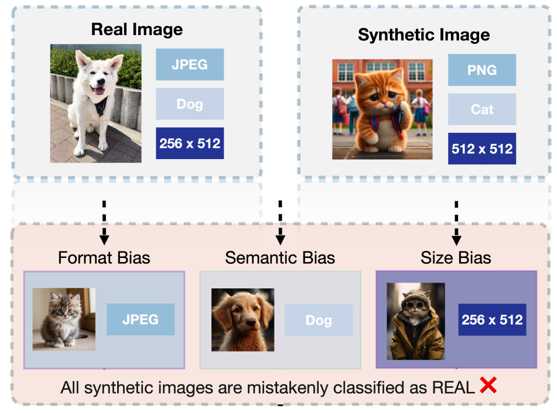
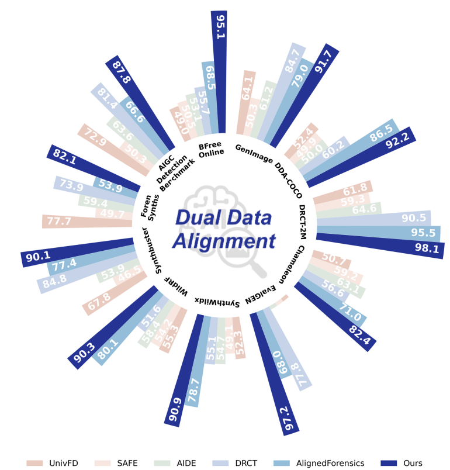
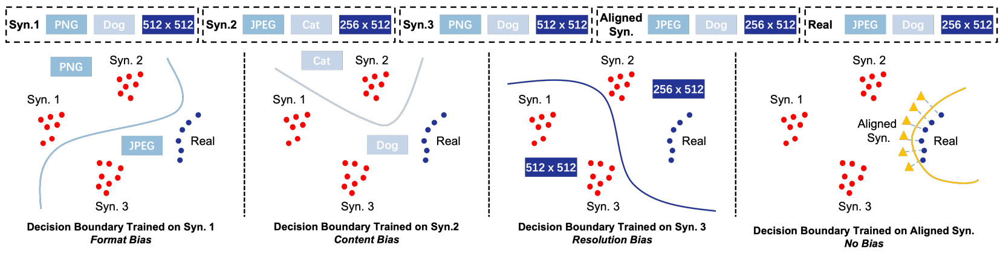
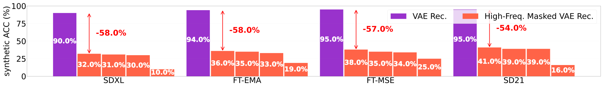
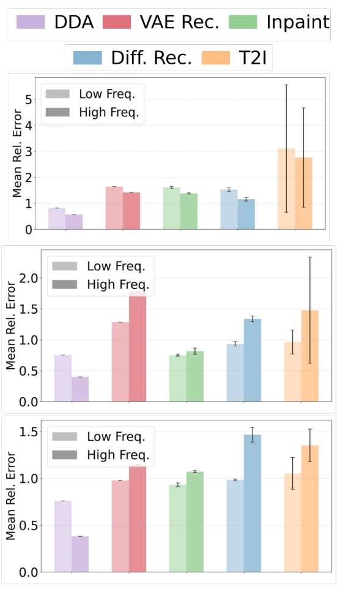

<div align="right">

[← Back to Home](../../README.md)

</div>

<h1 align="center">Dual Data Alignment Makes AI-Generated Image Detector Easier Generalizable</h1>

---

## Paper Information

| Field | Value |
|---|---|
| Title | Dual Data Alignment Makes AI-Generated Image Detector Easier Generalizable |
| Venue | NeurIPS |
| Year | 2025 |
| Topic | AI-generated image detection, dual pixel-frequency data alignment, detector generalization |
| Paper | [arXiv:2505.14359](https://arxiv.org/abs/2505.14359) |
| Code | [roy-ch/Dual-Data-Alignment](https://github.com/roy-ch/Dual-Data-Alignment) |
| Asset Type | Method figures, result analysis figures |

---

## Asset Preview Gallery

<table>
  <tr>
    <th>Method Figures</th>
    <th>Result Figures</th>
    <th>Table Figures</th>
  </tr>
  <tr>
    <td align="center">
      <br>
      <sub>Dataset Biases in AI-generated Image Detection</sub>
    </td>
    <td align="center">
      <br>
      <sub>Cross-benchmark Detection Accuracy Comparison</sub>
    </td>
    <td align="center">
      <sub>No table figures provided</sub>
    </td>
  </tr>
  <tr>
    <td align="center">
      <br>
      <sub>Decision Boundaries under Dual Data Alignment</sub>
    </td>
    <td align="center">
      <br>
      <sub>High-frequency Masking Reduces Synthetic Shortcut Accuracy</sub>
    </td>
    <td align="center">
    </td>
  </tr>
  <tr>
    <td align="center">
    </td>
    <td align="center">
      <br>
      <sub>Low- and High-frequency Reconstruction Error Comparison</sub>
    </td>
    <td align="center">
    </td>
  </tr>
</table>

---

# 1. Method Figures

## Figure 1: Dataset Biases in AI-generated Image Detection

<p align="center">
  
</p>

| Asset | Link |
|---|---|
| Preview Image | [image1.png](method_figures/image1.png) |
| PPT Source | Not available |

### Color Palette

| Role | Swatch | Color | Hex |
|---|---|---|---|
| Real-image metadata block |  | Blue | `#9CC7E3` |
| Synthetic-image metadata block |  | Blue | `#C5D5EC` |
| Format and semantic bias panels |  | Pink | `#F3E3DC` |
| Size-bias highlight |  | Purple | `#8E88BA` |
| Misclassification warning |  | Red | `#F00000` |

---

## Figure 2: Decision Boundaries under Dual Data Alignment

<p align="center">
  
</p>

| Asset | Link |
|---|---|
| Preview Image | [image2.png](method_figures/image2.png) |
| PPT Source | Not available |

### Color Palette

| Role | Swatch | Color | Hex |
|---|---|---|---|
| Synthetic sample clusters |  | Red | `#FF0000` |
| Real sample cluster |  | Blue | `#24399A` |
| Aligned synthetic samples |  | Yellow | `#FDB515` |
| Bias-specific decision boundary |  | Blue | `#9EBBD6` |
| Bias-free aligned boundary |  | Yellow | `#F0B400` |

---

# 2. Result Analysis Figures

## Figure 3: Cross-benchmark Detection Accuracy Comparison

<p align="center">
  
</p>

| Asset | Link |
|---|---|
| Preview Image | [image1.png](result_figures/image1.png) |

### Plotting Code

Note: The following code is an approximate visual reconstruction based on the provided figure.

```python
import matplotlib.pyplot as plt
import numpy as np

plt.rcParams.update({"font.family": "DejaVu Sans", "font.size": 9})

benchmarks = [
    "AIGC\nDetect\nBenchmrk", "BFree\nOnline", "GenImage", "DDA-COCO",
    "DRCT-2M", "Chameleon", "EvalGEN", "SynthWildX",
    "WildFake", "Synthbuster", "Foren\nSynths",
]
methods = ["UnivFD", "SAFE", "AIDE", "DRCT", "AlignedForensics", "Ours"]
colors = ["#EACBBB", "#F4E4DE", "#DCE8DB", "#C7D5EA", "#91BDD7", "#2637A4"]
values = np.array([
    [72.9, 50.3, 63.6, 81.4, 66.6, 87.8],
    [49.6, 50.5, 53.3, 55.7, 68.5, 95.1],
    [64.1, 50.3, 61.2, 84.4, 79.0, 91.7],
    [52.4, 49.9, 50.0, 60.2, 86.5, 92.2],
    [61.8, 59.3, 64.6, 90.5, 95.5, 98.1],
    [50.7, 59.2, 63.1, 56.6, 71.0, 82.4],
    [52.3, 49.1, 55.7, 55.1, 78.7, 97.2],
    [55.3, 58.4, 59.7, 57.6, 78.7, 90.9],
    [67.8, 46.5, 53.9, 84.8, 77.4, 90.1],
    [77.7, 49.7, 59.4, 73.9, 53.9, 82.1],
    [72.9, 50.3, 63.6, 81.4, 66.6, 87.8],
])

n_groups, n_methods = values.shape
theta = np.linspace(0, 2 * np.pi, n_groups, endpoint=False)
width = 2 * np.pi / n_groups / (n_methods + 1.2)

fig = plt.figure(figsize=(8.2, 8.2), dpi=130)
ax = fig.add_subplot(111, projection="polar")
ax.set_theta_offset(np.pi / 2)
ax.set_theta_direction(-1)
ax.set_ylim(0, 110)
ax.set_yticklabels([])
ax.set_xticks([])
ax.grid(False)
ax.spines["polar"].set_visible(False)

for j, (method, color) in enumerate(zip(methods, colors)):
    angles = theta + (j - (n_methods - 1) / 2) * width
    bars = ax.bar(angles, values[:, j], width=width * 0.94, bottom=31,
                  color=color, edgecolor="white", linewidth=0.4, label=method)
    for angle, val in zip(angles, values[:, j]):
        if method in ["Ours", "AlignedForensics"] or val > 80:
            ax.text(angle, val + 35, f"{val:.1f}", rotation=np.degrees(np.pi / 2 - angle),
                    ha="center", va="center", fontsize=7.5, color="white" if method == "Ours" else "white",
                    fontweight="bold")

for angle, label in zip(theta, benchmarks):
    ax.text(angle, 29, label, rotation=np.degrees(np.pi / 2 - angle),
            ha="center", va="center", fontsize=7, fontweight="bold")

ax.text(0, 0, "Dual Data\nAlignment", ha="center", va="center",
        fontsize=18, fontstyle="italic", color="#24399A", fontweight="bold")
legend = ax.legend(loc="lower center", bbox_to_anchor=(0.5, -0.08), ncol=6, frameon=False, fontsize=9)
plt.tight_layout()
plt.show()
```

---

## Figure 4: High-frequency Masking Reduces Synthetic Shortcut Accuracy

<p align="center">
  
</p>

| Asset | Link |
|---|---|
| Preview Image | [image2.png](result_figures/image2.png) |

### Plotting Code

Note: The following code is an approximate visual reconstruction based on the provided figure.

```python
import matplotlib.pyplot as plt
import numpy as np

plt.rcParams.update({"font.family": "DejaVu Sans", "font.size": 14})

groups = ["SDXL", "FT-EMA", "FT-MSE", "SD21"]
vae = np.array([90, 94, 95, 95])
masked = [
    [32, 31, 30, 10],
    [36, 35, 33, 19],
    [38, 35, 34, 25],
    [41, 39, 39, 16],
]
drops = [-58, -58, -57, -54]

fig, ax = plt.subplots(figsize=(15.5, 2.6), dpi=130)
x_base = np.arange(len(groups)) * 5.0
purple = "#9B31D0"
orange = "#FF5A45"

for i, x0 in enumerate(x_base):
    ax.bar(x0, vae[i], width=0.9, color=purple, edgecolor="white", linewidth=1.0)
    ax.text(x0, vae[i] * 0.54, f"{vae[i]:.1f}%", color="white",
            ha="center", va="center", fontweight="bold")
    for j, val in enumerate(masked[i]):
        x = x0 + 0.92 + j * 0.88
        ax.bar(x, val, width=0.86, color=orange, edgecolor="white", linewidth=1.0)
        ax.text(x, max(5, val * 0.55), f"{val:.1f}%", color="white",
                ha="center", va="center", fontweight="bold")

    x_arrow = x0 + 0.95
    ax.annotate("", xy=(x_arrow, vae[i]), xytext=(x_arrow, masked[i][0]),
                arrowprops=dict(arrowstyle="<->", color="red", lw=1.2))
    ax.text(x_arrow + 0.25, (vae[i] + masked[i][0]) / 2, f"{drops[i]:.1f}%",
            color="red", fontsize=14, fontweight="bold", va="center")

ax.set_xlim(-1.4, x_base[-1] + 5.2)
ax.set_ylim(0, 100)
ax.set_ylabel("Synthetic ACC (%)", fontsize=16)
ax.set_xticks(x_base + 1.65)
ax.set_xticklabels(groups, fontsize=15)
ax.set_yticks([0, 25, 50, 75, 100])
ax.grid(axis="y", color="0.92", linewidth=0.6)
ax.legend(
    [plt.Rectangle((0, 0), 1, 1, color=purple), plt.Rectangle((0, 0), 1, 1, color=orange)],
    ["VAE Rec.", "High-Freq. Masked VAE Rec."],
    loc="upper right", ncol=2, frameon=True, fontsize=14
)
for spine in ax.spines.values():
    spine.set_color("0.75")

plt.tight_layout()
plt.show()
```

---

## Figure 5: Low- and High-frequency Reconstruction Error Comparison

<p align="center">
  
</p>

| Asset | Link |
|---|---|
| Preview Image | [image3.png](result_figures/image3.png) |

### Plotting Code

Note: The following code is an approximate visual reconstruction based on the provided figure.

```python
import matplotlib.pyplot as plt
import numpy as np

plt.rcParams.update({"font.family": "DejaVu Sans", "font.size": 12})

methods = ["DDA", "VAE Rec.", "Inpaint", "Diff. Rec.", "T2I"]
colors = ["#C9B5E0", "#DE6B78", "#93CB8D", "#8EB8D7", "#FFC183"]
panels = [
    ("GenImage", [0.82, 1.62, 1.58, 1.55, 3.10], [0.55, 1.42, 1.38, 1.15, 2.75],
     [0.03, 0.02, 0.04, 0.08, 2.45], [0.02, 0.03, 0.03, 0.07, 1.90], (0, 5.8)),
    ("DDA-COCO", [0.74, 1.28, 0.76, 0.94, 0.96], [0.40, 1.82, 0.81, 1.35, 1.48],
     [0.02, 0.02, 0.03, 0.04, 0.20], [0.01, 0.05, 0.04, 0.05, 0.85], (0, 2.35)),
    ("EvalGEN", [0.75, 0.98, 0.93, 0.99, 1.05], [0.38, 1.12, 1.07, 1.45, 1.34],
     [0.02, 0.02, 0.03, 0.02, 0.18], [0.01, 0.03, 0.02, 0.08, 0.16], (0, 1.65)),
]

fig, axes = plt.subplots(3, 1, figsize=(5.1, 8.7), dpi=130, sharex=True)
x = np.arange(len(methods))
width = 0.28

for ax, (title, low, high, low_err, high_err, ylim) in zip(axes, panels):
    low = np.array(low)
    high = np.array(high)
    for i, color in enumerate(colors):
        ax.bar(x[i] - width / 2, low[i], width, color=color, alpha=0.48,
               yerr=low_err[i], capsize=2, error_kw=dict(lw=0.8, ecolor="0.35"))
        ax.bar(x[i] + width / 2, high[i], width, color=color, alpha=0.78,
               yerr=high_err[i], capsize=2, error_kw=dict(lw=0.8, ecolor="0.35"))
    ax.set_ylabel("Mean Rel. Error")
    ax.set_ylim(*ylim)
    ax.grid(axis="y", linestyle="--", alpha=0.22)
    ax.legend(
        [plt.Rectangle((0, 0), 1, 1, color="0.75"), plt.Rectangle((0, 0), 1, 1, color="0.55")],
        ["Low Freq.", "High Freq."],
        loc="upper left",
        frameon=True,
        fontsize=10,
    )
    ax.text(0.98, 0.91, title, transform=ax.transAxes, ha="right", va="top",
            fontsize=9, color="0.35")
    for spine in ax.spines.values():
        spine.set_color("0.65")

axes[-1].set_xticks(x)
axes[-1].set_xticklabels(methods, rotation=0)

handles = [plt.Rectangle((0, 0), 1, 1, color=c) for c in colors]
fig.legend(handles, methods, loc="upper center", ncol=3, frameon=True, fontsize=15,
           bbox_to_anchor=(0.5, 1.01))
plt.tight_layout(rect=(0, 0, 1, 0.95))
plt.show()
```

---

# 3. Paper Tables

No table figures were provided in `tables/` for this paper entry.
