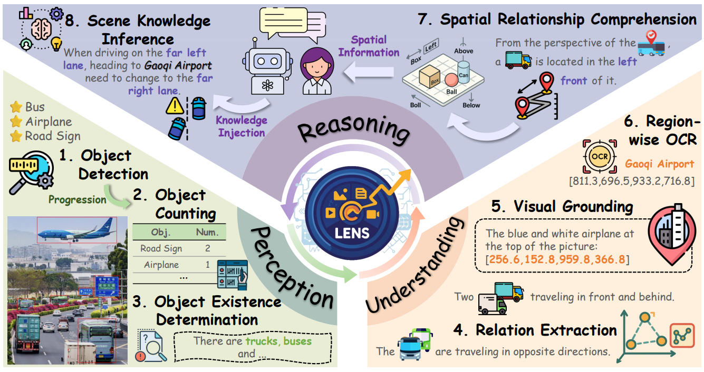
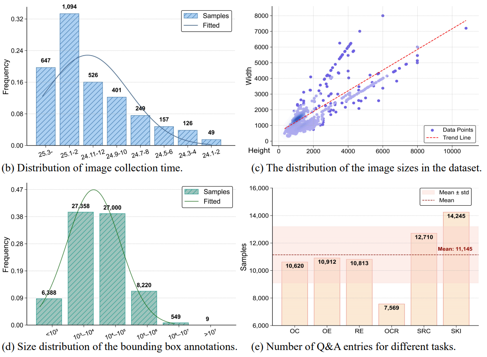
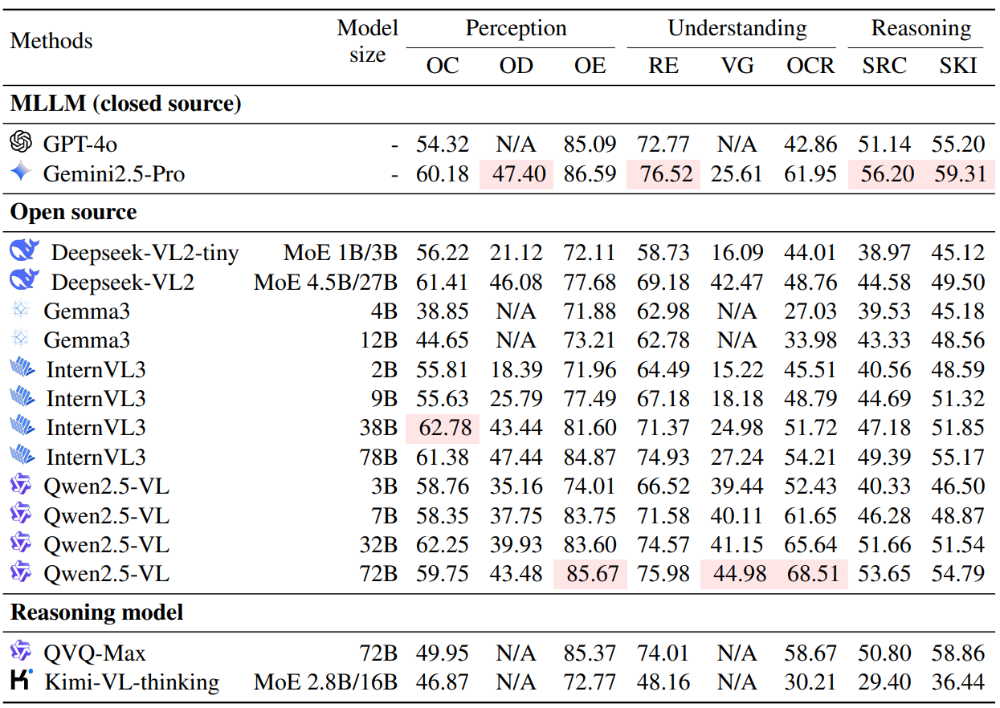
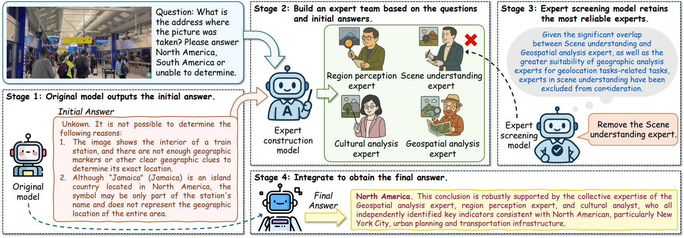
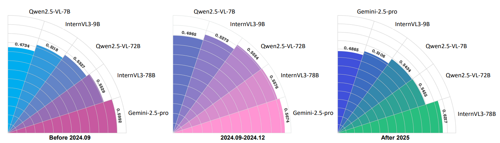

<div align="right">

[← Back to Home](../../README.md)

</div>

<h1 align="center">LENS: Multi-level Evaluation of Multimodal Reasoning with Large Language Models</h1>

---

## Paper Information

| Field | Value |
|---|---|
| Title | LENS: Multi-level Evaluation of Multimodal Reasoning with Large Language Models |
| Venue | ICLR |
| Year | 2026 |
| Topic | Multimodal reasoning evaluation, perception-understanding-reasoning task hierarchy, MLLM benchmarking |
| Paper | [arXiv:2505.15616](https://arxiv.org/abs/2505.15616) |
| Code | [Lens4MLLMs/lens](https://github.com/Lens4MLLMs/lens) |
| Asset Type | Method figures, result analysis figures, paper tables |

---

## Asset Preview Gallery

<table>
  <tr>
    <th>Method Figures</th>
    <th>Result Figures</th>
    <th>Table Figures</th>
  </tr>
  <tr>
    <td align="center">
      <br>
      <sub>LENS Multi-level Task Taxonomy</sub>
    </td>
    <td align="center">
      <br>
      <sub>LENS Dataset Statistics</sub>
    </td>
    <td align="center">
      <br>
      <sub>Multi-level MLLM Benchmark Results</sub>
    </td>
  </tr>
  <tr>
    <td align="center">
      <br>
      <sub>Self-driven Multi-expert Collaborative Reasoning</sub>
    </td>
    <td align="center">
      <br>
      <sub>Model Performance across Image Collection Periods</sub>
    </td>
    <td align="center">
    </td>
  </tr>
</table>

---

# 1. Method Figures

## Figure 1: LENS Multi-level Task Taxonomy

<p align="center">
  
</p>

| Asset | Link |
|---|---|
| Preview Image | [image1.png](method_figures/image1.png) |
| PPT Source | Not available |

### Color Palette

| Role | Swatch | Color | Hex |
|---|---|---|---|
| Central LENS benchmark hub |  | Blue | `#172E72` |
| Perception task tier |  | Green | `#DDE8C5` |
| Understanding task tier |  | Orange | `#F6DDC0` |
| Reasoning task tier |  | Purple | `#C5C7DF` |
| Task-specific icon highlights |  | Yellow | `#FFB12A` |

---

## Figure 2: Self-driven Multi-expert Collaborative Reasoning

<p align="center">
  
</p>

| Asset | Link |
|---|---|
| Preview Image | [image2.png](method_figures/image2.png) |
| PPT Source | Not available |

### Color Palette

| Role | Swatch | Color | Hex |
|---|---|---|---|
| Original model and initial answer |  | Blue | `#1D6B8A` |
| Expert construction stage |  | Green | `#6AA04D` |
| Expert screening rationale |  | Blue | `#0068F0` |
| Removed unreliable expert |  | Red | `#FF0000` |
| Final integrated answer |  | Yellow | `#FFD433` |

---

# 2. Result Analysis Figures

## Figure 3: LENS Dataset Statistics

<p align="center">
  
</p>

| Asset | Link |
|---|---|
| Preview Image | [image1.png](result_figures/image1.png) |

### Plotting Code

Note: The following code is an approximate visual reconstruction based on the provided figure.

```python
import matplotlib.pyplot as plt
import numpy as np

plt.rcParams.update({
    "font.family": "DejaVu Serif",
    "font.size": 11,
})

fig, axes = plt.subplots(2, 2, figsize=(10.2, 7.5), dpi=130)

# (b) Collection time distribution.
ax = axes[0, 0]
dates = ["25.3", "25.1-2", "24.11-12", "24.9-10", "24.7-8", "24.5-6", "24.3-4", "24.1-2"]
counts = np.array([647, 1094, 526, 401, 249, 157, 126, 49])
freq = counts / counts.sum()
x = np.arange(len(dates))
ax.bar(x, freq, color="#9CCAF0", edgecolor="#3C7DBA", hatch="///", linewidth=0.8, label="Samples")
xx = np.linspace(0, len(dates) - 1, 250)
curve = 0.035 + 0.19 * np.exp(-0.5 * ((xx - 1.8) / 1.7) ** 2)
ax.plot(xx, curve, color="#426C9E", lw=1.1, label="Fitted")
for i, (c, f) in enumerate(zip(counts, freq)):
    ax.text(i, f + 0.014, f"{c:,}", ha="center", va="bottom", fontsize=8, fontweight="bold")
ax.set_ylabel("Frequency")
ax.set_xticks(x)
ax.set_xticklabels(dates, rotation=18)
ax.set_ylim(0, 0.35)
ax.set_yticks([0, 0.08, 0.16, 0.24, 0.32])
ax.legend(loc="upper right", frameon=True)
ax.grid(axis="y", linestyle="--", color="0.82", linewidth=0.5)
ax.text(-0.12, -0.20, "(b) Distribution of image collection time.", transform=ax.transAxes, fontsize=14)

# (c) Image size scatter.
ax = axes[0, 1]
np.random.seed(4)
n = 250
height = np.r_[np.random.gamma(3.2, 430, n), np.random.uniform(2500, 6200, 45)]
width = height * np.random.uniform(0.65, 1.65, height.shape[0]) + np.random.normal(0, 280, height.shape[0])
height = np.clip(height, 200, 10500)
width = np.clip(width, 250, 8000)
ax.scatter(height, width, s=18, color="#6E63E6", alpha=0.82, edgecolor="none", label="Data Points")
trend_x = np.array([400, 10800])
ax.plot(trend_x, 0.66 * trend_x + 420, "--", color="red", lw=1.0, label="Trend Line")
ax.set_xlabel("Height")
ax.set_ylabel("Width")
ax.set_xlim(-350, 11200)
ax.set_ylim(-300, 8500)
ax.grid(True, linestyle="--", color="0.82", linewidth=0.5)
ax.legend(loc="lower right", frameon=True, fontsize=8)
ax.text(-0.10, -0.20, "(c) The distribution of the image sizes in the dataset.", transform=ax.transAxes, fontsize=14)

# (d) Bounding box size distribution.
ax = axes[1, 0]
bins = [r"$<10^3$", r"$10^3-10^4$", r"$10^4-10^5$", r"$10^5-10^6$", r"$10^6-10^7$", r"$>10^7$"]
box_counts = np.array([6388, 27358, 27000, 8220, 549, 9])
box_freq = box_counts / box_counts.sum()
x = np.arange(len(bins))
ax.bar(x, box_freq, color="#79CFC4", edgecolor="#21A89E", hatch="///", linewidth=0.8, label="Samples")
xx = np.linspace(0, len(bins) - 1, 240)
curve = 0.47 * np.exp(-0.5 * ((xx - 1.65) / 0.75) ** 2)
ax.plot(xx, curve, color="#1E7B27", lw=1.0, label="Fitted")
for i, (c, f) in enumerate(zip(box_counts, box_freq)):
    ax.text(i, f + 0.012, f"{c:,}", ha="center", va="bottom", fontsize=8, fontweight="bold")
ax.set_ylabel("Frequency")
ax.set_xticks(x)
ax.set_xticklabels(bins, rotation=18)
ax.set_ylim(0, 0.48)
ax.set_yticks([0, 0.09, 0.19, 0.28, 0.38, 0.47])
ax.legend(loc="upper right", frameon=True)
ax.grid(axis="y", linestyle="--", color="0.82", linewidth=0.5)
ax.text(-0.12, -0.20, "(d) Size distribution of the bounding box annotations.", transform=ax.transAxes, fontsize=14)

# (e) Q&A entries by task.
ax = axes[1, 1]
tasks = ["OC", "OE", "RE", "OCR", "SRC", "SKI"]
qa_counts = np.array([10620, 10912, 10813, 7569, 12710, 14245])
mean = 11145
std_low, std_high = 9000, 13200
x = np.arange(len(tasks))
ax.axhspan(std_low, std_high, color="#F5B8A9", alpha=0.25, label="Mean ± std")
bars = ax.bar(x, qa_counts, color="#FDE7C7", edgecolor="#F1A192", linewidth=0.8)
ax.axhline(mean, color="#B13C33", linestyle="--", linewidth=0.9, label="Mean")
ax.text(4.45, mean + 350, "Mean: 11,145", color="#9B241D", fontsize=8, fontweight="bold")
for bar, count in zip(bars, qa_counts):
    ax.text(bar.get_x() + bar.get_width() / 2, count - 350, f"{count:,}", ha="center", va="top", fontsize=8, fontweight="bold")
ax.set_ylabel("Samples")
ax.set_xticks(x)
ax.set_xticklabels(tasks)
ax.set_ylim(6000, 16000)
ax.set_yticks([6000, 8000, 10000, 12000, 14000, 16000])
ax.set_yticklabels(["6,000", "8,000", "10,000", "12,000", "14,000", "16,000"])
ax.grid(axis="y", linestyle="--", color="0.82", linewidth=0.5)
ax.legend(loc="upper right", frameon=True, fontsize=8)
ax.text(-0.10, -0.20, "(e) Number of Q&A entries for different tasks.", transform=ax.transAxes, fontsize=14)

for ax in axes.flat:
    ax.spines["top"].set_visible(False)
    ax.spines["right"].set_visible(False)

plt.tight_layout(h_pad=2.6, w_pad=2.0)
plt.show()
```

---

## Figure 4: Model Performance across Image Collection Periods

<p align="center">
  
</p>

| Asset | Link |
|---|---|
| Preview Image | [image2.png](result_figures/image2.png) |

### Plotting Code

Note: The following code is an approximate visual reconstruction based on the provided figure.

```python
import matplotlib.pyplot as plt
import numpy as np

plt.rcParams.update({"font.family": "DejaVu Sans", "font.size": 11})

panels = [
    ("Before 2024.09", ["Qwen2.5-VL-7B", "InternVL3-9B", "Qwen2.5-VL-72B", "InternVL3-78B", "Gemini-2.5-pro"],
     [0.4734, 0.5118, 0.5327, 0.5529, 0.5592], ["#00A9DF", "#5C8ED6", "#9271BE", "#C34FA0", "#C653A5"]),
    ("2024.09-2024.12", ["Qwen2.5-VL-7B", "InternVL3-9B", "Qwen2.5-VL-72B", "InternVL3-78B", "Gemini-2.5-pro"],
     [0.4965, 0.5273, 0.5554, 0.5576, 0.5674], ["#5D74C5", "#8067C8", "#B078CC", "#D978C3", "#FF7EC7"]),
    ("After 2025", ["Gemini-2.5-pro", "InternVL3-9B", "Qwen2.5-VL-7B", "Qwen2.5-VL-72B", "InternVL3-78B"],
     [0.4865, 0.5106, 0.5348, 0.5435, 0.6277], ["#3357E2", "#2C72C8", "#36A09E", "#2FB977", "#24BF6B"]),
]

fig, axes = plt.subplots(1, 3, figsize=(13.6, 3.8), dpi=130, subplot_kw={"projection": "polar"})

for ax, (title, labels, values, colors) in zip(axes, panels):
    n = len(labels)
    theta = np.linspace(np.pi / 2, 0, n)
    width = (np.pi / 2) / n * 0.94
    radii = np.array(values)
    bars = ax.bar(theta, radii, width=width, bottom=0, color=colors, edgecolor="white", linewidth=0.6, align="edge")

    ax.set_theta_zero_location("E")
    ax.set_theta_direction(1)
    ax.set_thetamin(0)
    ax.set_thetamax(90)
    ax.set_ylim(0, 0.70)
    ax.set_yticks(np.linspace(0.1, 0.7, 7))
    ax.set_yticklabels([])
    ax.set_xticks(theta + width / 2)
    ax.set_xticklabels(labels, fontsize=10)
    ax.grid(color="#D5D5D5", linewidth=0.7)
    ax.spines["polar"].set_color("#D2D2D2")

    for angle, value in zip(theta + width / 2, values):
        ax.text(angle, value + 0.035, f"{value:.4f}", rotation=np.rad2deg(angle) - 70,
                ha="center", va="center", fontsize=7.5, fontweight="bold")

    ax.text(np.deg2rad(45), -0.08, title, ha="center", va="center", fontsize=10, fontweight="bold")

plt.tight_layout(w_pad=2.0)
plt.show()
```

---

# 3. Paper Tables

## Table 1: Multi-level MLLM Benchmark Results

<p align="center">
  
</p>

| Asset | Link |
|---|---|
| Preview Image | [image1.png](tables/image1.png) |

### LaTeX Source

```latex
\begin{table*}[t]
\centering
\caption{Performance of closed-source, open-source, and reasoning MLLMs on the LENS perception, understanding, and reasoning tasks.}
\label{tab:lens-main-results}
\resizebox{\textwidth}{!}{
\begin{tabular}{llcccccccc}
\toprule
\multirow{2}{*}{\textbf{Methods}} & \multirow{2}{*}{\textbf{Model size}} &
\multicolumn{3}{c}{\textbf{Perception}} &
\multicolumn{3}{c}{\textbf{Understanding}} &
\multicolumn{2}{c}{\textbf{Reasoning}} \\
\cmidrule(lr){3-5}\cmidrule(lr){6-8}\cmidrule(lr){9-10}
& & \textbf{OC} & \textbf{OD} & \textbf{OE} & \textbf{RE} & \textbf{VG} & \textbf{OCR} & \textbf{SRC} & \textbf{SKI} \\
\midrule
\multicolumn{10}{l}{\textbf{MLLM (closed source)}} \\
GPT-4o & - & 54.32 & N/A & 85.09 & 72.77 & N/A & 42.86 & 51.14 & 55.20 \\
Gemini2.5-Pro & - & 60.18 & \cellcolor{red!12}47.40 & 86.59 & \cellcolor{red!12}76.52 & 25.61 & 61.95 & 56.20 & \cellcolor{red!12}59.31 \\
\midrule
\multicolumn{10}{l}{\textbf{Open source}} \\
Deepseek-VL2-tiny & MoE 1B/3B & 56.22 & 21.12 & 72.11 & 58.73 & 16.09 & 44.01 & 38.97 & 45.12 \\
Deepseek-VL2 & MoE 4.5B/27B & 61.41 & 46.08 & 77.68 & 69.18 & 42.47 & 48.76 & 44.58 & 49.50 \\
Gemma3 & 4B & 38.85 & N/A & 71.88 & 62.98 & N/A & 27.03 & 39.53 & 45.18 \\
Gemma3 & 12B & 44.65 & N/A & 73.21 & 62.78 & N/A & 33.98 & 43.33 & 48.56 \\
InternVL3 & 2B & 55.81 & 18.39 & 71.96 & 64.49 & 15.22 & 45.51 & 40.56 & 48.59 \\
InternVL3 & 9B & 55.63 & 25.79 & 77.49 & 67.18 & 18.18 & 48.79 & 44.69 & 51.32 \\
InternVL3 & 38B & \cellcolor{red!12}62.78 & 43.44 & 81.60 & 71.37 & 24.98 & 51.72 & 47.18 & 51.85 \\
InternVL3 & 78B & 61.38 & 47.44 & 84.87 & 74.93 & 27.24 & 54.21 & 49.39 & 55.17 \\
Qwen2.5-VL & 3B & 58.76 & 35.16 & 74.01 & 66.52 & 39.44 & 52.43 & 40.33 & 46.50 \\
Qwen2.5-VL & 7B & 58.35 & 37.75 & 83.75 & 71.58 & 40.11 & 61.65 & 46.28 & 48.87 \\
Qwen2.5-VL & 32B & 62.25 & 39.93 & 83.60 & 74.57 & 41.15 & 65.64 & 51.66 & 51.54 \\
Qwen2.5-VL & 72B & 59.75 & 43.48 & \cellcolor{red!12}85.67 & 75.98 & \cellcolor{red!12}44.98 & 68.51 & 53.65 & 54.79 \\
\midrule
\multicolumn{10}{l}{\textbf{Reasoning model}} \\
QVQ-Max & 72B & 49.95 & N/A & 85.37 & 74.01 & N/A & 58.67 & 50.80 & 58.86 \\
Kimi-VL-thinking & MoE 2.8B/16B & 46.87 & N/A & 72.77 & 48.16 & N/A & 30.21 & 29.40 & 36.44 \\
\bottomrule
\end{tabular}
}
\end{table*}
```

### Required Packages

```latex
\usepackage{booktabs}
\usepackage{multirow}
\usepackage[table]{xcolor}
\usepackage{graphicx}
```
