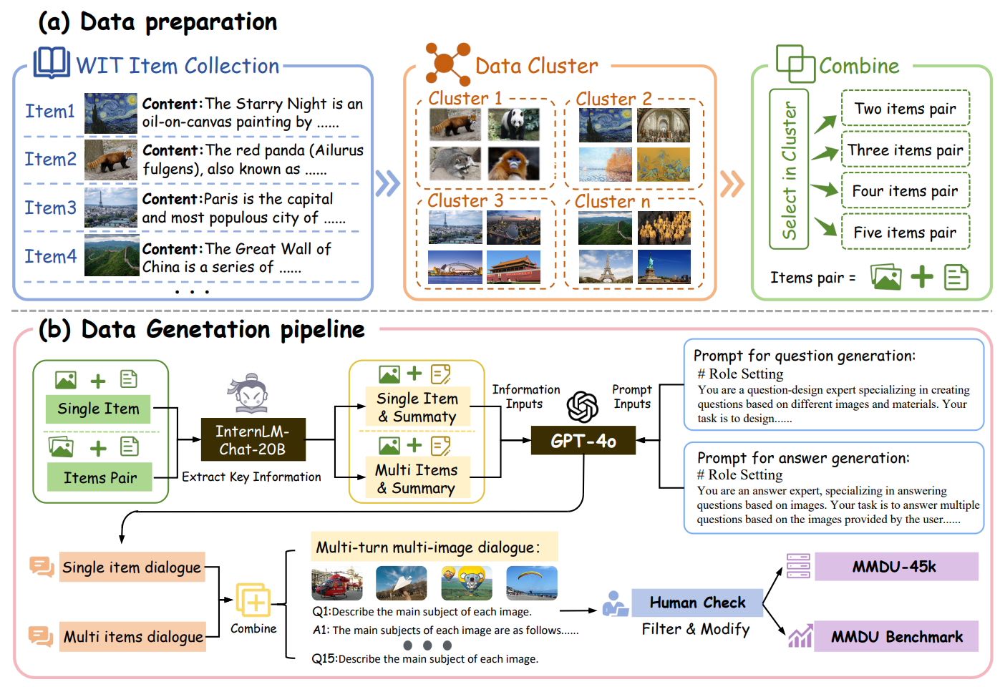
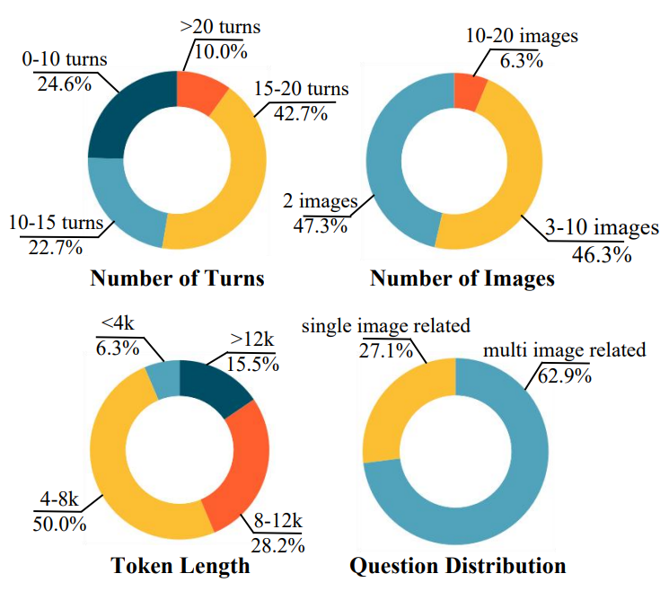
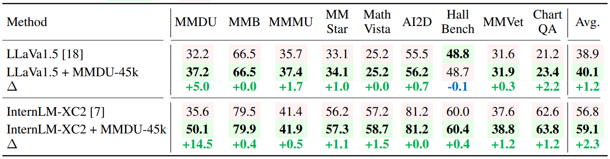
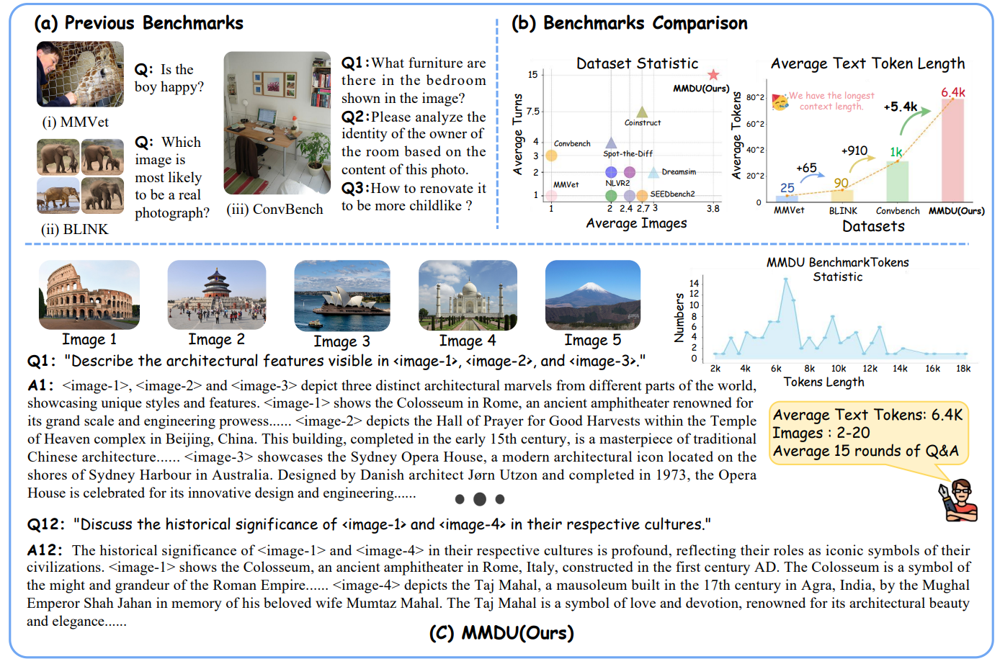

<div align="right">

[← Back to Home](../../README.md)

</div>

<h1 align="center">MMDU: A Multi-Turn Multi-Image Dialog Understanding Benchmark and Instruction-Tuning Dataset for LVLMs</h1>

---

## Paper Information

| Field | Value |
|---|---|
| Title | MMDU: A Multi-Turn Multi-Image Dialog Understanding Benchmark and Instruction-Tuning Dataset for LVLMs |
| Venue | NeurIPS |
| Year | 2024 |
| Topic | Multi-turn multi-image dialogue understanding, LVLM evaluation, long-context instruction tuning |
| Paper | [arXiv:2406.11833](https://arxiv.org/abs/2406.11833) |
| Code | [Liuziyu77/MMDU](https://github.com/Liuziyu77/MMDU) |
| Asset Type | Method figures, result analysis figures, paper tables |

---

## Asset Preview Gallery

<table>
  <tr>
    <th>Method Figures</th>
    <th>Result Figures</th>
    <th>Table Figures</th>
  </tr>
  <tr>
    <td align="center">
      <br>
      <sub>MMDU Data Preparation and Generation Pipeline</sub>
    </td>
    <td align="center">
      <br>
      <sub>MMDU Dialogue and Context Statistics</sub>
    </td>
    <td align="center">
      <br>
      <sub>MMDU-45k Fine-tuning Benchmark Gains</sub>
    </td>
  </tr>
  <tr>
    <td align="center">
      <br>
      <sub>Benchmark Comparison and MMDU Dialogue Example</sub>
    </td>
    <td align="center">
    </td>
    <td align="center">
    </td>
  </tr>
</table>

---

# 1. Method Figures

## Figure 1: MMDU Data Preparation and Generation Pipeline

<p align="center">
  
</p>

| Asset | Link |
|---|---|
| Preview Image | [image1.png](method_figures/image1.png) |
| PPT Source | Not available |

### Color Palette

| Role | Swatch | Color | Hex |
|---|---|---|---|
| Wikipedia item collection |  | Blue | `#4D6DB7` |
| Data clustering stage |  | Orange | `#C75E0A` |
| Item-pair combination |  | Green | `#5D963F` |
| GPT-4o prompt generation |  | Yellow | `#F3C64B` |
| Human check and released datasets |  | Purple | `#B68AD9` |

---

## Figure 2: Benchmark Comparison and MMDU Dialogue Example

<p align="center">
  
</p>

| Asset | Link |
|---|---|
| Preview Image | [image2.png](method_figures/image2.png) |
| PPT Source | Not available |

### Color Palette

| Role | Swatch | Color | Hex |
|---|---|---|---|
| Benchmark comparison frame |  | Blue | `#75A7F2` |
| MMDU dataset marker |  | Red | `#E83F45` |
| Average token length bars |  | Green | `#B8D7B8` |
| Multi-image example thumbnails |  | Yellow | `#F4C64F` |
| Dialogue statistics callout |  | Yellow | `#FFE8A3` |

---

# 2. Result Analysis Figures

## Figure 3: MMDU Dialogue and Context Statistics

<p align="center">
  
</p>

| Asset | Link |
|---|---|
| Preview Image | [image1.png](result_figures/image1.png) |

### Plotting Code

Note: The following code is an approximate visual reconstruction based on the provided figure.

```python
import matplotlib.pyplot as plt
import numpy as np

plt.rcParams.update({
    "font.family": "DejaVu Serif",
    "font.size": 13,
})

charts = [
    {
        "title": "Number of Turns",
        "values": [24.6, 22.7, 42.7, 10.0],
        "labels": ["0-10 turns\n24.6%", "10-15 turns\n22.7%", "15-20 turns\n42.7%", ">20 turns\n10.0%"],
        "colors": ["#075D73", "#53A9B9", "#FFC63D", "#FF5A2F"],
        "startangle": 90,
    },
    {
        "title": "Number of Images",
        "values": [47.3, 46.3, 6.3],
        "labels": ["2 images\n47.3%", "3-10 images\n46.3%", "10-20 images\n6.3%"],
        "colors": ["#58AFC1", "#FFC63D", "#FF5A2F"],
        "startangle": 90,
    },
    {
        "title": "Token Length",
        "values": [6.3, 50.0, 28.2, 15.5],
        "labels": ["<4k\n6.3%", "4-8k\n50.0%", "8-12k\n28.2%", ">12k\n15.5%"],
        "colors": ["#4EA6B5", "#FFC63D", "#FF5A2F", "#065D73"],
        "startangle": 90,
    },
    {
        "title": "Question Distribution",
        "values": [27.1, 62.9],
        "labels": ["single image related\n27.1%", "multi image related\n62.9%"],
        "colors": ["#FFC63D", "#58AFC1"],
        "startangle": 90,
    },
]

fig, axes = plt.subplots(2, 2, figsize=(7.1, 6.1), dpi=130)
axes = axes.ravel()

for ax, cfg in zip(axes, charts):
    wedges, _ = ax.pie(
        cfg["values"],
        startangle=cfg["startangle"],
        colors=cfg["colors"],
        counterclock=True,
        wedgeprops=dict(width=0.40, edgecolor="none"),
    )
    ax.set(aspect="equal")
    ax.set_title(cfg["title"], y=-0.12, fontsize=15, fontweight="bold")

    for wedge, label in zip(wedges, cfg["labels"]):
        angle = np.deg2rad((wedge.theta1 + wedge.theta2) / 2)
        x, y = np.cos(angle), np.sin(angle)
        tx = 1.36 * x
        ty = 1.25 * y
        ha = "left" if tx > 0 else "right"
        ax.annotate(
            label,
            xy=(0.82 * x, 0.82 * y),
            xytext=(tx, ty),
            ha=ha,
            va="center",
            fontsize=12,
            arrowprops=dict(
                arrowstyle="-",
                color="black",
                lw=1.0,
                shrinkA=0,
                shrinkB=0,
                connectionstyle="angle3,angleA=0,angleB=90",
            ),
        )

    ax.set_xlim(-1.55, 1.55)
    ax.set_ylim(-1.42, 1.42)

plt.tight_layout(w_pad=1.2, h_pad=1.6)
plt.show()
```

---

# 3. Paper Tables

## Table 1: MMDU-45k Fine-tuning Benchmark Gains

<p align="center">
  
</p>

| Asset | Link |
|---|---|
| Preview Image | [image1.png](tables/image1.png) |

### LaTeX Source

```latex
\begin{table*}[t]
\centering
\caption{Benchmark performance before and after fine-tuning LVLMs with MMDU-45k.}
\label{tab:mmdu45k-finetuning}
\resizebox{\textwidth}{!}{
\begin{tabular}{lcccccccccc}
\toprule
\textbf{Method} & \textbf{MMDU} & \textbf{MMB} & \textbf{MMMU} & \textbf{MM Star} & \textbf{Math Vista} & \textbf{AI2D} & \textbf{Hall Bench} & \textbf{MMVet} & \textbf{Chart QA} & \textbf{Avg.} \\
\midrule
LLaVa1.5~\cite{liu2023llava} & \cellcolor{red!7}32.2 & \cellcolor{red!7}66.5 & \cellcolor{red!7}35.7 & \cellcolor{red!7}33.1 & \cellcolor{red!7}25.2 & \cellcolor{red!7}55.5 & \cellcolor{green!10}\textbf{48.8} & \cellcolor{red!7}31.6 & \cellcolor{red!7}21.2 & \cellcolor{red!7}38.9 \\
LLaVa1.5 + MMDU-45k & \cellcolor{green!12}\textbf{37.2} & \cellcolor{green!12}\textbf{66.5} & \cellcolor{green!12}\textbf{37.4} & \cellcolor{green!12}\textbf{34.1} & \cellcolor{green!12}\textbf{25.2} & \cellcolor{green!12}\textbf{56.2} & \cellcolor{red!7}48.7 & \cellcolor{green!12}\textbf{31.9} & \cellcolor{green!12}\textbf{23.4} & \cellcolor{green!12}\textbf{40.1} \\
$\Delta$ & \textcolor{green!65!black}{\textbf{+5.0}} & \textcolor{green!65!black}{\textbf{+0.0}} & \textcolor{green!65!black}{\textbf{+1.7}} & \textcolor{green!65!black}{\textbf{+1.0}} & \textcolor{green!65!black}{\textbf{+0.0}} & \textcolor{green!65!black}{\textbf{+0.7}} & \textcolor{blue!70!black}{\textbf{-0.1}} & \textcolor{green!65!black}{\textbf{+0.3}} & \textcolor{green!65!black}{\textbf{+2.2}} & \textcolor{green!65!black}{\textbf{+1.2}} \\
\midrule
InternLM-XC2~\cite{internlm2024} & \cellcolor{red!7}35.6 & \cellcolor{red!7}79.5 & \cellcolor{red!7}41.4 & \cellcolor{red!7}56.2 & \cellcolor{red!7}57.2 & \cellcolor{red!7}81.2 & \cellcolor{red!7}60.0 & \cellcolor{red!7}37.6 & \cellcolor{red!7}62.6 & \cellcolor{red!7}56.8 \\
InternLM-XC2 + MMDU-45k & \cellcolor{green!12}\textbf{50.1} & \cellcolor{green!12}\textbf{79.9} & \cellcolor{green!12}\textbf{41.9} & \cellcolor{green!12}\textbf{57.3} & \cellcolor{green!12}\textbf{58.7} & \cellcolor{green!12}\textbf{81.2} & \cellcolor{green!12}\textbf{60.4} & \cellcolor{green!12}\textbf{38.8} & \cellcolor{green!12}\textbf{63.8} & \cellcolor{green!12}\textbf{59.1} \\
$\Delta$ & \textcolor{green!65!black}{\textbf{+14.5}} & \textcolor{green!65!black}{\textbf{+0.4}} & \textcolor{green!65!black}{\textbf{+0.5}} & \textcolor{green!65!black}{\textbf{+1.1}} & \textcolor{green!65!black}{\textbf{+1.5}} & \textcolor{green!65!black}{\textbf{+0.0}} & \textcolor{green!65!black}{\textbf{+0.4}} & \textcolor{green!65!black}{\textbf{+1.2}} & \textcolor{green!65!black}{\textbf{+1.2}} & \textcolor{green!65!black}{\textbf{+2.3}} \\
\bottomrule
\end{tabular}
}
\end{table*}
```

### Required Packages

```latex
\usepackage{booktabs}
\usepackage[table]{xcolor}
\usepackage{graphicx}
```
