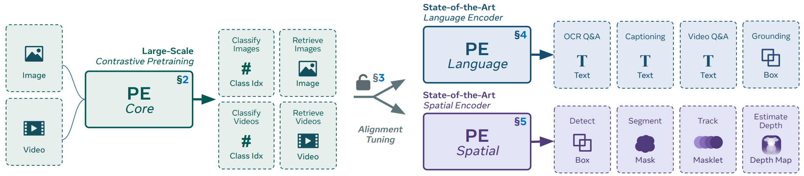
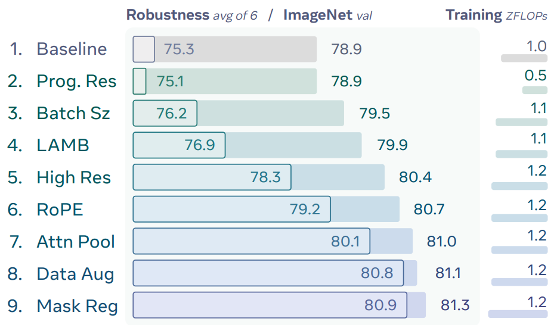
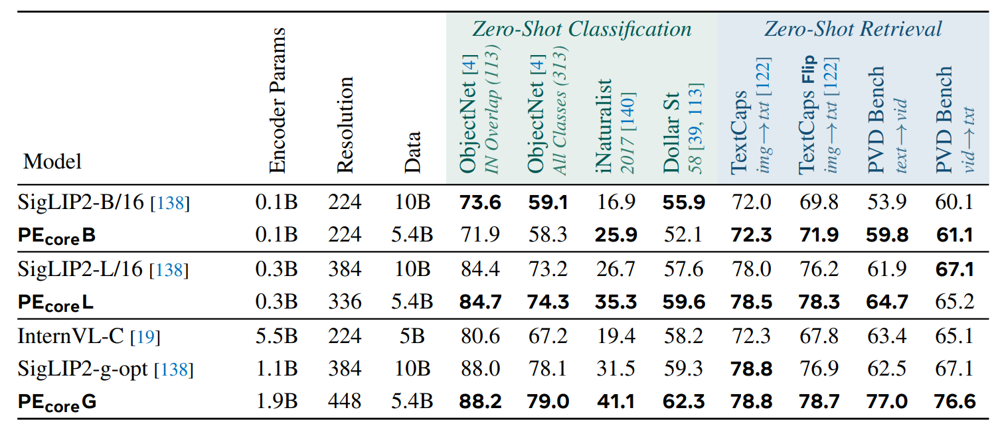
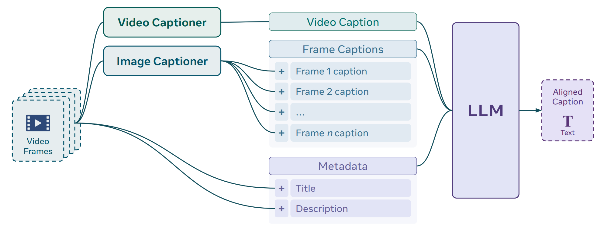
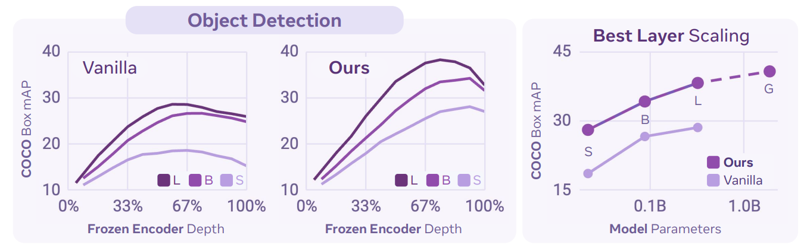

<div align="right">

[← Back to Home](../../README.md)

</div>

<h1 align="center">Perception Encoder: The best visual embeddings are not at the output of the network</h1>

---

## Paper Information

| Field | Value |
|---|---|
| Title | Perception Encoder: The best visual embeddings are not at the output of the network |
| Venue | NeurIPS |
| Year | 2025 |
| Topic | Vision-language contrastive pretraining, intermediate visual embeddings, language and spatial alignment |
| Paper | [arXiv:2504.13181](https://arxiv.org/abs/2504.13181) |
| Code | [facebookresearch/perception_models](https://github.com/facebookresearch/perception_models) |
| Asset Type | Method figures, result analysis figures, paper tables |

---

## Asset Preview Gallery

<table>
  <tr>
    <th>Method Figures</th>
    <th>Result Figures</th>
    <th>Table Figures</th>
  </tr>
  <tr>
    <td align="center">
      <br>
      <sub>Perception Encoder Family Overview</sub>
    </td>
    <td align="center">
      <br>
      <sub>Training Recipe Ablation</sub>
    </td>
    <td align="center">
      <br>
      <sub>Zero-Shot Classification and Retrieval Comparison</sub>
    </td>
  </tr>
  <tr>
    <td align="center">
      <br>
      <sub>Video Caption Alignment Pipeline</sub>
    </td>
    <td align="center">
      <br>
      <sub>Intermediate Layer Scaling for Object Detection</sub>
    </td>
    <td align="center">
    </td>
  </tr>
</table>

---

# 1. Method Figures

## Figure 1: Perception Encoder Family Overview

<p align="center">
  
</p>

| Asset | Link |
|---|---|
| Preview Image | [image1.png](method_figures/image1.png) |
| PPT Source | Not available |

### Color Palette

| Role | Swatch | Color | Hex |
|---|---|---|---|
| PE Core contrastive encoder |  | Teal | `#00625C` |
| Input and pretraining tasks |  | Teal | `#E8F3F0` |
| Alignment tuning connector |  | Gray | `#6F7D82` |
| PE Language branch |  | Blue | `#0E5B88` |
| PE Spatial branch |  | Purple | `#5A4387` |

---

## Figure 2: Video Caption Alignment Pipeline

<p align="center">
  
</p>

| Asset | Link |
|---|---|
| Preview Image | [image2.png](method_figures/image2.png) |
| PPT Source | Not available |

### Color Palette

| Role | Swatch | Color | Hex |
|---|---|---|---|
| Video frame input |  | Teal | `#0A5969` |
| Captioner modules |  | Teal | `#E7F0F0` |
| Frame caption stack |  | Blue | `#DDEAF3` |
| Metadata stack |  | Purple | `#E1E2F6` |
| LLM alignment block |  | Purple | `#564180` |

---

# 2. Result Analysis Figures

## Figure 3: Training Recipe Ablation

<p align="center">
  
</p>

| Asset | Link |
|---|---|
| Preview Image | [image1.png](result_figures/image1.png) |

### Plotting Code

Note: The following code is an approximate visual reconstruction based on the provided figure.

```python
import matplotlib.pyplot as plt
import numpy as np
from matplotlib.patches import FancyBboxPatch

steps = [
    "Baseline", "Prog. Res", "Batch Sz", "LAMB", "High Res",
    "RoPE", "Attn Pool", "Data Aug", "Mask Reg",
]
robustness = np.array([75.3, 75.1, 76.2, 76.9, 78.3, 79.2, 80.1, 80.8, 80.9])
imagenet = np.array([78.9, 78.9, 79.5, 79.9, 80.4, 80.7, 81.0, 81.1, 81.3])
training = np.array([1.0, 0.5, 1.1, 1.1, 1.2, 1.2, 1.2, 1.2, 1.2])

colors = [
    "#DCDCDC", "#CFE3DE", "#C9E0DF", "#C5DCE1", "#C2DAE3",
    "#C3D7E7", "#C9D6E9", "#D2D9EE", "#D9DDF2",
]
edge_colors = [
    "#657396", "#00756B", "#007F82", "#108097", "#1B78A3",
    "#2A78AA", "#3B78A8", "#4D6EAD", "#5B68A9",
]

fig, ax = plt.subplots(figsize=(9.3, 5.4), dpi=120)
fig.patch.set_facecolor("white")
ax.set_facecolor("#FAFBFB")

y = np.arange(len(steps))[::-1]
x0 = 73.9
ax.barh(y, robustness - x0, left=x0, height=0.78, color=colors, edgecolor="none")

for i, yi in enumerate(y):
    inset_w = max(0.45, robustness[i] - x0 - 0.45)
    box = FancyBboxPatch(
        (x0 + 0.05, yi - 0.34), inset_w, 0.68,
        boxstyle="round,pad=0.02,rounding_size=0.045",
        linewidth=1.15, edgecolor=edge_colors[i], facecolor="none"
    )
    ax.add_patch(box)
    ax.text(robustness[i] - 0.08, yi, f"{robustness[i]:.1f}",
            ha="right", va="center", fontsize=16, color=edge_colors[i])
    ax.text(imagenet[i], yi, f"{imagenet[i]:.1f}",
            ha="left", va="center", fontsize=16, color="#005D72")
    ax.text(82.15, yi + 0.18, f"{training[i]:.1f}",
            ha="right", va="center", fontsize=15, color="#0B4F75")
    ax.plot([81.45, 82.15], [yi - 0.24, yi - 0.24],
            color=colors[i], linewidth=7, solid_capstyle="round")

ax.set_yticks(y)
ax.set_yticklabels([f"{i + 1}.   {name}" for i, name in enumerate(steps)],
                   fontsize=17, color="#005D72")
ax.tick_params(axis="y", length=0)
ax.set_xticks([])
ax.set_xlim(73.8, 82.35)
ax.set_ylim(-0.65, len(steps) - 0.15)

ax.text(73.9, len(steps) - 0.05, "Robustness $avg\\ of\\ 6$  /  ImageNet $val$",
        fontsize=13.5, fontweight="bold", color="#4B587E")
ax.text(82.15, len(steps) - 0.05, "Training $zFLOPs$",
        fontsize=13.5, fontweight="bold", color="#4B587E", ha="right")

for spine in ax.spines.values():
    spine.set_visible(False)

plt.tight_layout(pad=0.5)
plt.show()
```

---

## Figure 4: Intermediate Layer Scaling for Object Detection

<p align="center">
  
</p>

| Asset | Link |
|---|---|
| Preview Image | [image2.png](result_figures/image2.png) |

### Plotting Code

Note: The following code is an approximate visual reconstruction based on the provided figure.

```python
import matplotlib.pyplot as plt
import numpy as np
from matplotlib.patches import FancyBboxPatch
from matplotlib.lines import Line2D

depth = np.array([0.05, 0.15, 0.25, 0.33, 0.42, 0.50, 0.58, 0.67, 0.75, 0.83, 0.92, 1.00])
vanilla_l = np.array([12, 16, 20, 24, 26, 27.8, 28.6, 28.7, 28.2, 27.0, 26.3, 25.5])
vanilla_b = np.array([11, 14.5, 18.2, 21, 23.1, 25.0, 26.4, 26.8, 26.8, 26.2, 25.8, 24.8])
vanilla_s = np.array([10.5, 13, 15, 16.6, 17.8, 18.0, 18.5, 18.6, 18.2, 17.2, 16.5, 14.9])
ours_l = np.array([12.1, 16.8, 21.2, 26, 30, 33.8, 35.8, 37.7, 38.3, 38.0, 36.8, 33.5])
ours_b = np.array([11, 14.7, 18.4, 21.3, 24.5, 27.6, 30.0, 32.0, 33.4, 33.6, 34.0, 31.5])
ours_s = np.array([10.2, 13, 15.5, 18, 20.5, 22.5, 24.2, 25.8, 27.0, 27.5, 28.1, 27.0])

fig = plt.figure(figsize=(13.5, 4.25), dpi=120)
fig.patch.set_facecolor("white")

left_bg = FancyBboxPatch((0.02, 0.05), 0.61, 0.86, transform=fig.transFigure,
                         boxstyle="round,pad=0.008,rounding_size=0.025",
                         facecolor="#F6F3FB", edgecolor="none", zorder=-5)
right_bg = FancyBboxPatch((0.66, 0.05), 0.32, 0.86, transform=fig.transFigure,
                          boxstyle="round,pad=0.008,rounding_size=0.025",
                          facecolor="#F6F3FB", edgecolor="none", zorder=-5)
title_bg = FancyBboxPatch((0.165, 0.86), 0.31, 0.10, transform=fig.transFigure,
                          boxstyle="round,pad=0.006,rounding_size=0.02",
                          facecolor="#DED9F1", edgecolor="none", zorder=-4)
fig.add_artist(left_bg)
fig.add_artist(right_bg)
fig.add_artist(title_bg)
fig.text(0.32, 0.91, "Object Detection", ha="center", va="center",
         fontsize=22, fontweight="bold", color="#755994")

gs = fig.add_gridspec(1, 3, left=0.08, right=0.95, bottom=0.25, top=0.78,
                      width_ratios=[1, 1, 1.1], wspace=0.32)
axes = [fig.add_subplot(gs[0, i]) for i in range(3)]
dark, mid, light = "#6C387B", "#8D4DB0", "#B39BE2"

for ax, title, ys in [
    (axes[0], "Vanilla", [vanilla_l, vanilla_b, vanilla_s]),
    (axes[1], "Ours", [ours_l, ours_b, ours_s]),
]:
    for series, color in zip(ys, [dark, mid, light]):
        ax.plot(depth, series, color=color, linewidth=3)
    ax.set_xlim(0, 1)
    ax.set_ylim(9, 40)
    ax.set_xticks([0, 0.33, 0.67, 1.0])
    ax.set_xticklabels(["0%", "33%", "67%", "100%"], fontsize=15, color="#75659C")
    ax.set_yticks([10, 20, 30, 40])
    ax.set_yticklabels(["10", "20", "30", "40"], fontsize=15, color="#75659C")
    ax.grid(True, color="#DDD7EA", linewidth=1.2)
    ax.text(0.08, 0.86, title, transform=ax.transAxes, fontsize=18,
            fontweight="bold" if title == "Ours" else "normal", color="#6C387B")
    for spine in ax.spines.values():
        spine.set_color("#DDD7EA")
    ax.tick_params(length=0)

axes[0].set_ylabel("COCO Box mAP", fontsize=14, color="#75659C", labelpad=8)
fig.text(0.325, 0.085, "Frozen Encoder Depth", ha="center",
         fontsize=15, color="#75659C", fontweight="bold")
fig.text(0.435, 0.085, "Depth", ha="center", fontsize=15, color="#75659C")

legend_handles = [
    Line2D([0], [0], marker="s", color="none", markerfacecolor=dark, markeredgecolor=dark, markersize=12, label="L"),
    Line2D([0], [0], marker="s", color="none", markerfacecolor=mid, markeredgecolor=mid, markersize=12, label="B"),
    Line2D([0], [0], marker="s", color="none", markerfacecolor=light, markeredgecolor=light, markersize=12, label="S"),
]
axes[0].legend(handles=legend_handles, loc="lower right", frameon=False, ncol=3,
               handlelength=0.2, handletextpad=0.5, columnspacing=1.0, fontsize=13)
axes[1].legend(handles=legend_handles, loc="lower right", frameon=False, ncol=3,
               handlelength=0.2, handletextpad=0.5, columnspacing=1.0, fontsize=13)

ax = axes[2]
x = np.array([0.0, 0.33, 0.67, 1.0])
ours = np.array([28, 34, 38, 40.5])
vanilla = np.array([18, 26.5, 28.5, np.nan])
ax.plot(x, ours, color=mid, marker="o", markersize=10, linewidth=3)
ax.plot(x[2:], ours[2:], color=mid, linestyle=(0, (4, 4)), linewidth=3)
ax.plot(x[:3], vanilla[:3], color=light, marker="o", markersize=10, linewidth=3)
for label, xi, yi in zip(["S", "B", "L", "G"], x, ours):
    ax.text(xi, yi - 4.0, label, ha="center", fontsize=13, color="#755994")
ax.set_title("Best Layer Scaling", fontsize=20, fontweight="bold", color="#6C387B", pad=10)
ax.set_xlim(-0.05, 1.05)
ax.set_ylim(15, 45)
ax.set_xticks([0.33, 0.85])
ax.set_xticklabels(["0.1B", "1.0B"], fontsize=16, color="#75659C")
ax.set_yticks([15, 30, 45])
ax.set_yticklabels(["15", "30", "45"], fontsize=16, color="#75659C")
ax.set_xlabel("Model Parameters", fontsize=14, color="#75659C", fontweight="bold", labelpad=10)
ax.set_ylabel("COCO Box mAP", fontsize=14, color="#75659C", labelpad=8)
ax.grid(True, color="#DDD7EA", linewidth=1.2)
for spine in ax.spines.values():
    spine.set_visible(False)
ax.tick_params(length=0)
ax.legend(handles=[
    Line2D([0], [0], marker="s", color="none", markerfacecolor=mid, markeredgecolor=mid, markersize=12, label="Ours"),
    Line2D([0], [0], marker="s", color="none", markerfacecolor=light, markeredgecolor=light, markersize=12, label="Vanilla"),
], loc="lower right", frameon=False, fontsize=13)

plt.show()
```

---

# 3. Paper Tables

## Table 1: Zero-Shot Classification and Retrieval Comparison

<p align="center">
  
</p>

| Asset | Link |
|---|---|
| Preview Image | [image1.png](tables/image1.png) |

### LaTeX Source

```latex
\begin{table}[t]
\centering
\caption{Zero-shot classification and retrieval comparison for Perception Encoder core models.}
\label{tab:zero-shot-classification-retrieval}
\setlength{\tabcolsep}{4.5pt}
\renewcommand{\arraystretch}{1.08}
\begin{adjustbox}{max width=\linewidth}
\begin{tabular}{lccc>{\columncolor{teal!8}}c>{\columncolor{teal!8}}c>{\columncolor{teal!8}}c>{\columncolor{teal!8}}c>{\columncolor{blue!8}}c>{\columncolor{blue!8}}c>{\columncolor{blue!8}}c>{\columncolor{blue!8}}c}
\toprule
& & & &
\multicolumn{4}{c}{\cellcolor{teal!8}\textit{\textcolor{teal!70!black}{Zero-Shot Classification}}} &
\multicolumn{4}{c}{\cellcolor{blue!8}\textit{\textcolor{blue!60!black}{Zero-Shot Retrieval}}} \\
\cmidrule(lr){5-8}\cmidrule(lr){9-12}
\textbf{Model} &
\rotatebox{90}{Encoder Params} &
\rotatebox{90}{Resolution} &
\rotatebox{90}{Data} &
\rotatebox{90}{\makecell{\textcolor{teal!70!black}{ObjectNet [4]}\\\textit{IN Overlap (113)}}} &
\rotatebox{90}{\makecell{\textcolor{teal!70!black}{ObjectNet [4]}\\\textit{All Classes (313)}}} &
\rotatebox{90}{\makecell{\textcolor{teal!70!black}{iNaturalist}\\\textit{2017 [140]}}} &
\rotatebox{90}{\makecell{\textcolor{teal!70!black}{Dollar St}\\\textit{58 [39, 113]}}} &
\rotatebox{90}{\makecell{\textcolor{blue!60!black}{TextCaps}\\\textit{img$\rightarrow$txt [122]}}} &
\rotatebox{90}{\makecell{\textcolor{blue!60!black}{TextCaps Flip}\\\textit{img$\rightarrow$txt [122]}}} &
\rotatebox{90}{\makecell{\textcolor{blue!60!black}{PVID Bench}\\\textit{text$\rightarrow$vid}}} &
\rotatebox{90}{\makecell{\textcolor{blue!60!black}{PVID Bench}\\\textit{vid$\rightarrow$txt}}} \\
\midrule
SigLIP2-B/16~\cite{siglip2} & 0.1B & 224 & 10B & \textbf{73.6} & \textbf{59.1} & 16.9 & \textbf{55.9} & 72.0 & 69.8 & 53.9 & 60.1 \\
\textbf{PE$_{\text{core}}$B} & 0.1B & 224 & 5.4B & 71.9 & 58.3 & \textbf{25.9} & 52.1 & \textbf{72.3} & \textbf{71.9} & \textbf{59.8} & \textbf{61.1} \\
\midrule
SigLIP2-L/16~\cite{siglip2} & 0.3B & 384 & 10B & 84.4 & 73.2 & 26.7 & 57.6 & 78.0 & 76.2 & 61.9 & \textbf{67.1} \\
\textbf{PE$_{\text{core}}$L} & 0.3B & 336 & 5.4B & \textbf{84.7} & \textbf{74.3} & \textbf{35.3} & \textbf{59.6} & \textbf{78.5} & \textbf{78.3} & \textbf{64.7} & 65.2 \\
\midrule
InternVL-C~\cite{internvl} & 5.5B & 224 & 5B & 80.6 & 67.2 & 19.4 & 58.2 & 72.3 & 67.8 & 63.4 & 65.1 \\
SigLIP2-g-opt~\cite{siglip2} & 1.1B & 384 & 10B & 88.0 & 78.1 & 31.5 & 59.3 & \textbf{78.8} & 76.9 & 62.5 & 67.1 \\
\textbf{PE$_{\text{core}}$G} & 1.9B & 448 & 5.4B & \textbf{88.2} & \textbf{79.0} & \textbf{41.1} & \textbf{62.3} & \textbf{78.8} & \textbf{78.7} & \textbf{77.0} & \textbf{76.6} \\
\bottomrule
\end{tabular}
\end{adjustbox}
\end{table}
```

### Required Packages

```latex
\usepackage{booktabs}
\usepackage[table]{xcolor}
\usepackage{graphicx}
\usepackage{makecell}
\usepackage{adjustbox}
```
