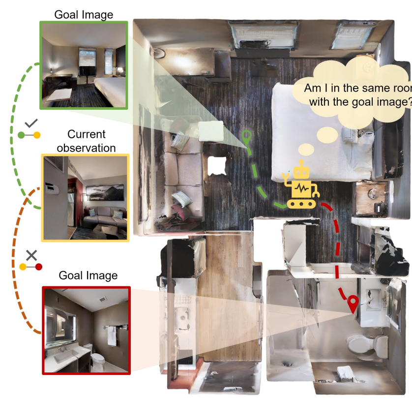
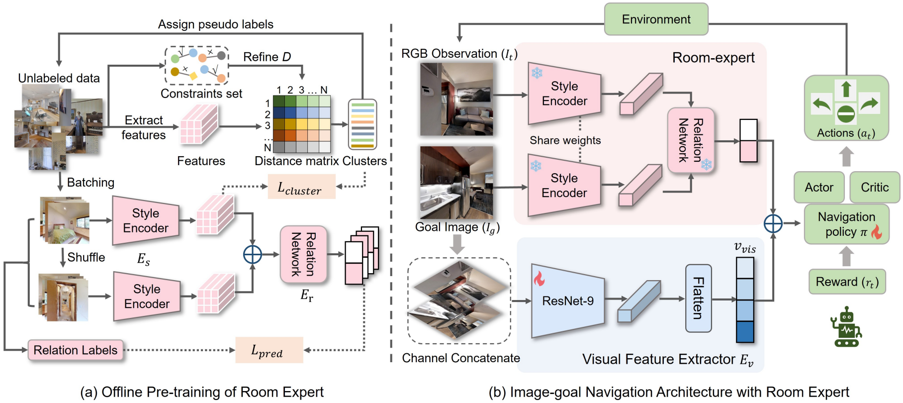

[← Back to Home](../../README.md)

<h1 align="center">REGNav: Room Expert Guided Image-Goal Navigation</h1>

---

## Paper Information

| Field | Value |
|---|---|
| Title | REGNav: Room Expert Guided Image-Goal Navigation |
| Venue | AAAI |
| Year | 2025 |
| Topic | Image-goal navigation, room-relation reasoning, room-expert guided embodied policy learning |
| Paper | [arXiv:2502.10785](https://arxiv.org/abs/2502.10785) |
| Code | [leeBooMla/REGNav](https://github.com/leeBooMla/REGNav) |
| Asset Type | Method figures |

---

## Asset Preview Gallery

<table>
  <tr>
    <th>Method Figures</th>
    <th>Result Figures</th>
    <th>Table Figures</th>
  </tr>
  <tr>
    <td align="center">
       
      Room-aware Image-goal Navigation Intuition
    </td>
    <td align="center">
      No result figures provided
    </td>
    <td align="center">
      No table figures provided
    </td>
  </tr>
  <tr>
    <td align="center">
       
      Room Expert Pretraining and Navigation Architecture
    </td>
    <td align="center">
    </td>
    <td align="center">
    </td>
  </tr>
</table>

---

# 1. Method Figures

## Figure 1: Room-aware Image-goal Navigation Intuition

  

| Asset | Link |
|---|---|
| Preview Image | [image1.png](method_figures/image1.png) |
| PPT Source | Not available |

### Color Palette

| Role | Swatch | Color | Hex |
|---|---|---|---|
| Same-room goal relation |  | Green | `#69AD45` |
| Current observation candidate |  | Yellow | `#F5CB4B` |
| Different-room goal relation |  | Red | `#C90000` |
| Alternative room transition cue |  | Orange | `#C45F09` |
| Navigation agent and uncertainty prompt |  | Yellow | `#FFD95A` |

---

## Figure 2: Room Expert Pretraining and Navigation Architecture

  

| Asset | Link |
|---|---|
| Preview Image | [image2.png](method_figures/image2.png) |
| PPT Source | Not available |

### Color Palette

| Role | Swatch | Color | Hex |
|---|---|---|---|
| Room style encoder and relation network |  | Pink | `#F3C6D4` |
| Offline pseudo-label clustering |  | Green | `#D9E9C7` |
| Visual feature extractor branch |  | Blue | `#DDE9F4` |
| Feature fusion and navigation vector |  | Blue | `#4E85B7` |
| Actor-critic navigation policy |  | Green | `#B7D5A4` |

---

# 2. Result Analysis Figures

No result figures were provided in `result_figures/` for this paper entry.

---

# 3. Paper Tables

No table figures were provided in `tables/` for this paper entry.
