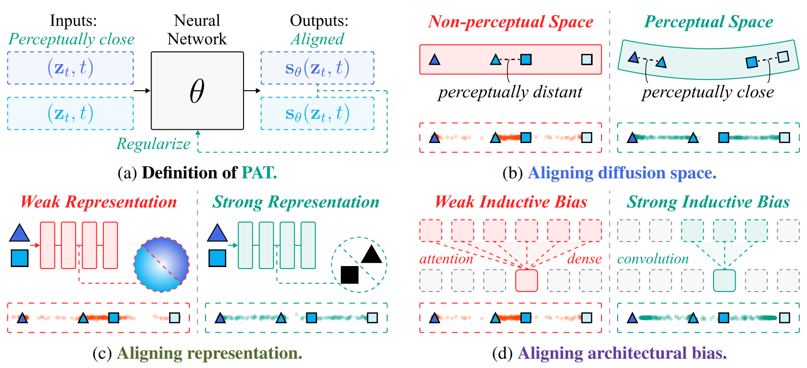
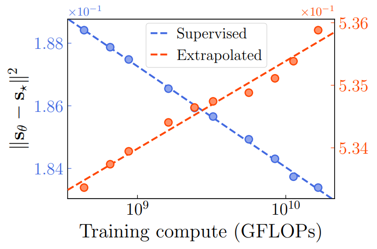
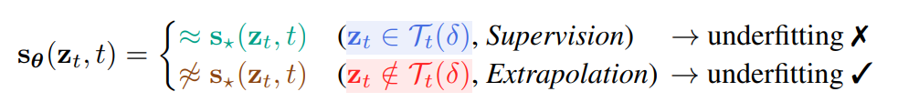
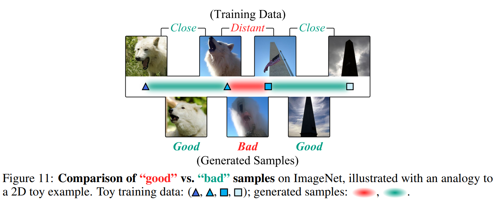
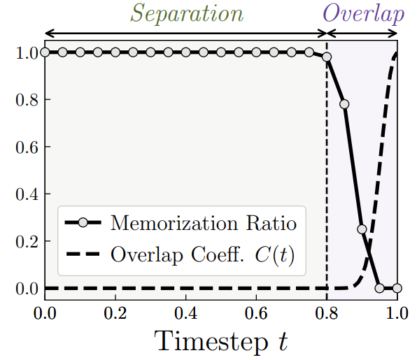
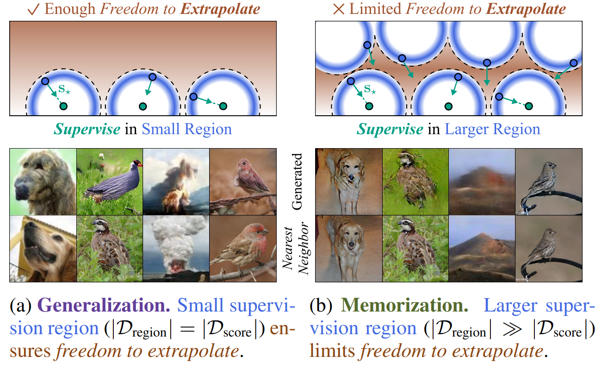
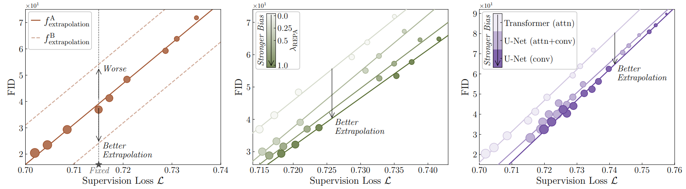

<div align="right">

[← Back to Home](../../README.md)

</div>

<h1 align="center">Selective Underfitting in Diffusion Models</h1>

---

## Paper Information

| Field | Value |
|---|---|
| Title | Selective Underfitting in Diffusion Models |
| Venue | arXiv |
| Year | 2025 |
| Topic | Diffusion model generalization, empirical score approximation, supervision and extrapolation regions |
| Paper | [arXiv:2510.01378](https://arxiv.org/abs/2510.01378) |
| Project | [selective-underfitting.github.io](https://selective-underfitting.github.io/) |
| Asset Type | Method figures, result analysis figures, paper tables |

---

## Asset Preview Gallery

<table>
  <tr>
    <th>Method Figures</th>
    <th>Result Figures</th>
    <th>Table Figures</th>
  </tr>
  <tr>
    <td align="center">
      <br>
      <sub>PAT Alignment and Selective Underfitting Mechanisms</sub>
    </td>
    <td align="center">
      <br>
      <sub>Supervised and Extrapolated Score Error under Scaling</sub>
    </td>
    <td align="center">
      <br>
      <sub>Selective Underfitting Definition</sub>
    </td>
  </tr>
  <tr>
    <td align="center">
      <br>
      <sub>Good and Bad Samples in Diffusion Space</sub>
    </td>
    <td align="center">
      <br>
      <sub>Memorization Ratio and Overlap across Timesteps</sub>
    </td>
    <td align="center">
    </td>
  </tr>
  <tr>
    <td align="center">
      <br>
      <sub>Supervision Region Size and Generalization-Memorization Trade-off</sub>
    </td>
    <td align="center">
      <br>
      <sub>Extrapolation Efficiency Scaling Law</sub>
    </td>
    <td align="center">
    </td>
  </tr>
</table>

---

# 1. Method Figures

## Figure 1: PAT Alignment and Selective Underfitting Mechanisms

<p align="center">
  
</p>

| Asset | Link |
|---|---|
| Preview Image | [image1.png](method_figures/image1.png) |
| PPT Source | Not available |

### Color Palette

| Role | Swatch | Color | Hex |
|---|---|---|---|
| Perceptual closeness and aligned regions |  | Teal | `#009E8E` |
| Non-perceptual or weak representation regions |  | Red | `#FF2A2A` |
| Score inputs and outputs |  | Blue | `#4A6DFF` |
| Architectural-bias comparison |  | Purple | `#6E3FB6` |
| Weak-to-strong inductive-bias paths |  | Pink | `#F7D7D7` |

---

## Figure 2: Good and Bad Samples in Diffusion Space

<p align="center">
  
</p>

| Asset | Link |
|---|---|
| Preview Image | [image2.png](method_figures/image2.png) |
| PPT Source | Not available |

### Color Palette

| Role | Swatch | Color | Hex |
|---|---|---|---|
| Good generated-sample neighborhoods |  | Teal | `#00A78E` |
| Bad generated-sample region |  | Red | `#FF3030` |
| Training data exemplars |  | Blue | `#6FA4DD` |
| Diffusion-space density band |  | Teal | `#A9E6DD` |
| Generated sample thumbnails |  | Gray | `#DDE7EE` |

---

## Figure 3: Supervision Region Size and Generalization-Memorization Trade-off

<p align="center">
  
</p>

| Asset | Link |
|---|---|
| Preview Image | [image3.png](method_figures/image3.png) |
| PPT Source | Not available |

### Color Palette

| Role | Swatch | Color | Hex |
|---|---|---|---|
| Extrapolation freedom background |  | Brown | `#A85A32` |
| Supervision shell and score field |  | Blue | `#4B73FF` |
| Learned score vectors |  | Teal | `#009E8E` |
| Generalization caption |  | Purple | `#6D56C7` |
| Memorization caption |  | Green | `#60723D` |

---

# 2. Result Analysis Figures

## Figure 4: Supervised and Extrapolated Score Error under Scaling

<p align="center">
  
</p>

| Asset | Link |
|---|---|
| Preview Image | [image1.png](result_figures/image1.png) |

### Plotting Code

Note: The following code is an approximate visual reconstruction based on the provided figure.

```python
import matplotlib.pyplot as plt
import numpy as np

plt.rcParams.update({
    "font.family": "DejaVu Serif",
    "mathtext.fontset": "dejavuserif",
    "font.size": 15,
})

compute = np.array([3.5e8, 6.2e8, 8.7e8, 1.6e9, 2.8e9, 4.6e9, 8.2e9, 1.1e10, 1.6e10])
supervised = np.array([0.1885, 0.1879, 0.1875, 0.1866, 0.1856, 0.1849, 0.1843, 0.1837, 0.1834])
extrapolated = np.array([0.5334, 0.5337, 0.5340, 0.5346, 0.5349, 0.5351, 0.5354, 0.5358, 0.5364])

fig, ax = plt.subplots(figsize=(6.0, 4.6), dpi=130)
ax2 = ax.twinx()

blue = "#4E6FDE"
orange = "#FF4A1C"
ax.plot(compute, supervised, "o", ms=8, color="#8EA7FF", mec=blue, mew=1.4)
ax.plot(compute, supervised, "--", lw=2.0, color=blue, label="Supervised")
ax2.plot(compute, extrapolated, "o", ms=8, color="#FF9A72", mec=orange, mew=1.4)
ax2.plot(compute, extrapolated, "--", lw=2.0, color=orange, label="Extrapolated")

ax.set_xscale("log")
ax.set_xlim(3.0e8, 2.1e10)
ax.set_ylim(0.1830, 0.1888)
ax2.set_ylim(0.5332, 0.5366)

ax.set_xlabel("Training compute (GFLOPs)", fontsize=18)
ax.set_ylabel(r"$||s_{\theta}-s_{\star}||^2$", fontsize=18)
ax.set_yticks([0.184, 0.186, 0.188])
ax2.set_yticks([0.534, 0.535, 0.536])
ax.tick_params(axis="y", colors=blue)
ax2.tick_params(axis="y", colors=orange)
ax.yaxis.label.set_color("black")
ax2.yaxis.offsetText.set_visible(False)
ax.yaxis.offsetText.set_visible(False)
ax.text(0.00, 1.02, r"$\times 10^{-1}$", transform=ax.transAxes, color=blue, fontsize=13)
ax2.text(0.87, 1.02, r"$\times 10^{-1}$", transform=ax2.transAxes, color=orange, fontsize=13)

lines = ax.get_lines()[1:2] + ax2.get_lines()[1:2]
labels = [line.get_label() for line in lines]
leg = ax.legend(lines, labels, loc="upper center", frameon=True, fontsize=16)
leg.get_frame().set_linewidth(0.6)

for spine in ax.spines.values():
    spine.set_linewidth(1.0)
for spine in ax2.spines.values():
    spine.set_linewidth(1.0)

plt.tight_layout()
plt.show()
```

---

## Figure 5: Memorization Ratio and Overlap across Timesteps

<p align="center">
  
</p>

| Asset | Link |
|---|---|
| Preview Image | [image2.png](result_figures/image2.png) |

### Plotting Code

Note: The following code is an approximate visual reconstruction based on the provided figure.

```python
import matplotlib.pyplot as plt
import numpy as np

plt.rcParams.update({
    "font.family": "DejaVu Serif",
    "mathtext.fontset": "dejavuserif",
    "font.size": 15,
})

t = np.linspace(0, 1, 21)
memorization = 1 / (1 + np.exp((t - 0.885) / 0.025))
memorization[t < 0.78] = 1.0
memorization[t > 0.95] = 0.0
overlap = 1 / (1 + np.exp(-(t - 0.955) / 0.018))

fig, ax = plt.subplots(figsize=(5.4, 4.5), dpi=130)
ax.axvspan(0.80, 1.0, color="#EFEAF7", alpha=0.9, zorder=0)
ax.plot(t, memorization, "-o", color="black", lw=2.7, ms=6.5, mfc="#D9D9D9", mec="black",
        label="Memorization Ratio")
ax.plot(t, overlap, "--", color="black", lw=3.0, label=r"Overlap Coeff. $C(t)$")

ax.axvline(0.80, color="black", ls="--", lw=1.6)
ax.annotate("", xy=(0.00, 1.08), xytext=(0.80, 1.08),
            arrowprops=dict(arrowstyle="<->", lw=1.5, color="black"))
ax.annotate("", xy=(0.80, 1.08), xytext=(1.00, 1.08),
            arrowprops=dict(arrowstyle="<->", lw=1.5, color="black"))
ax.text(0.40, 1.12, "Separation", color="#6F7B25", ha="center", va="bottom",
        fontsize=17, fontstyle="italic")
ax.text(0.90, 1.12, "Overlap", color="#6B3BA4", ha="center", va="bottom",
        fontsize=17, fontstyle="italic")

ax.set_xlim(0, 1.0)
ax.set_ylim(-0.05, 1.18)
ax.set_xlabel(r"Timestep $t$", fontsize=21)
ax.set_yticks(np.linspace(0, 1, 6))
ax.set_xticks(np.linspace(0, 1, 6))
leg = ax.legend(loc="lower left", frameon=True, fontsize=15)
leg.get_frame().set_linewidth(0.7)
ax.spines["top"].set_linewidth(1.0)
ax.spines["right"].set_linewidth(1.0)
ax.spines["left"].set_linewidth(1.0)
ax.spines["bottom"].set_linewidth(1.0)
ax.tick_params(direction="in", length=4)

plt.tight_layout()
plt.show()
```

---

## Figure 6: Extrapolation Efficiency Scaling Law

<p align="center">
  
</p>

| Asset | Link |
|---|---|
| Preview Image | [image3.png](result_figures/image3.png) |

### Plotting Code

Note: The following code is an approximate visual reconstruction based on the provided figure.

```python
import matplotlib.pyplot as plt
import numpy as np
from matplotlib.lines import Line2D

plt.rcParams.update({
    "font.family": "DejaVu Serif",
    "mathtext.fontset": "dejavuserif",
    "font.size": 12,
})

fig, axes = plt.subplots(1, 3, figsize=(14.0, 3.7), dpi=130)

# Panel 1: two extrapolation mappings for the same supervision loss.
x = np.array([0.702, 0.7045, 0.7085, 0.715, 0.7172, 0.7208, 0.7288, 0.7312, 0.735])
y = 1850 + 180000 * (x - 0.702) + np.array([0, 120, 220, -280, -80, 140, 70, 60, 180])
axes[0].scatter(x, y, s=65, color="#B26A48", edgecolor="#7B3C24", linewidth=0.8, zorder=3)
xx = np.linspace(0.700, 0.740, 100)
axes[0].plot(xx, 1850 + 180000 * (xx - 0.702), color="#A94E28", lw=1.4,
             label=r"$f^A_{\mathrm{extrapolation}}$")
axes[0].plot(xx, 3150 + 180000 * (xx - 0.702), "--", color="#D5A48E", lw=1.4,
             label=r"$f^B_{\mathrm{extrapolation}}$")
axes[0].plot(xx, 500 + 180000 * (xx - 0.702), "--", color="#D5A48E", lw=1.4)
axes[0].axvline(0.715, color="0.45", ls="--", lw=0.8)
axes[0].scatter([0.715], [1600], marker="*", s=110, color="0.3", zorder=4)
axes[0].annotate("", xy=(0.715, 5950), xytext=(0.715, 2500),
                 arrowprops=dict(arrowstyle="<->", lw=0.8, color="black"))
axes[0].text(0.716, 5900, "Worse", fontsize=12, fontstyle="italic", va="top")
axes[0].text(0.716, 2750, "Better\nExtrapolation", fontsize=12, fontstyle="italic", va="top")
axes[0].text(0.713, 1380, "Fixed", fontsize=11, color="0.45", fontstyle="italic")
axes[0].legend(loc="upper left", frameon=True, fontsize=10)
axes[0].set_xlim(0.700, 0.740)
axes[0].set_ylim(1500, 7500)

# Panel 2: RePA strength as extrapolation bias.
alphas = np.array([0.0, 0.25, 0.50, 1.0])
greens = ["#E7EAD9", "#C6D0B8", "#91A676", "#536D37"]
for a, color in zip(alphas, greens):
    xs = np.array([0.715, 0.7175, 0.720, 0.723, 0.727, 0.731, 0.735, 0.739])
    offset = 1080 * (1.0 - a)
    ys = 2700 + offset + 172000 * (xs - 0.715) + np.linspace(0, 320, len(xs))
    axes[1].scatter(xs, ys, s=60, color=color, edgecolor="#889474", linewidth=0.7)
    axes[1].plot([0.714, 0.742], [2700 + offset, 2700 + offset + 172000 * (0.742 - 0.714)],
                 color=color, lw=1.3)
axes[1].annotate("", xy=(0.726, 4100), xytext=(0.726, 5900),
                 arrowprops=dict(arrowstyle="->", lw=0.9, color="0.35"))
axes[1].text(0.7265, 4050, "Better\nExtrapolation", fontsize=12, fontstyle="italic", va="top")
axes[1].set_xlim(0.714, 0.743)
axes[1].set_ylim(2600, 7600)
sm = plt.cm.ScalarMappable(cmap=plt.cm.YlGn_r, norm=plt.Normalize(0, 1))
sm.set_array([])
cbar = fig.colorbar(sm, ax=axes[1], fraction=0.040, pad=0.02)
cbar.set_label(r"$\lambda_{\mathrm{REPA}}$", rotation=90, labelpad=6)
cbar.ax.invert_yaxis()
axes[1].text(0.03, 0.52, "Stronger Bias", transform=axes[1].transAxes,
             rotation=90, fontsize=11, fontstyle="italic")

# Panel 3: architecture bias families.
purple_sets = [
    ("Transformer (attn)", "#D8CBEA", 3700, 150000, np.array([0.702, 0.705, 0.708, 0.716, 0.719, 0.723, 0.728, 0.733, 0.739, 0.746])),
    ("U-Net (attn+conv)", "#9C85CE", 2600, 160000, np.array([0.716, 0.719, 0.722, 0.725, 0.729, 0.733, 0.738, 0.744, 0.750, 0.755])),
    ("U-Net (conv)", "#6A43B7", 1900, 166000, np.array([0.719, 0.722, 0.725, 0.728, 0.731, 0.735, 0.740, 0.745, 0.752, 0.758])),
]
for label, color, intercept, slope, xs in purple_sets:
    ys = intercept + slope * (xs - 0.700) + np.linspace(0, 550, len(xs))
    axes[2].scatter(xs, ys, s=np.linspace(70, 30, len(xs)), color=color,
                    edgecolor="#816AAA", linewidth=0.8, alpha=0.9)
    axes[2].plot([0.700, 0.760], [intercept, intercept + slope * 0.060], color=color, lw=1.4)
axes[2].annotate("", xy=(0.741, 6600), xytext=(0.741, 8050),
                 arrowprops=dict(arrowstyle="->", lw=0.9, color="0.35"))
axes[2].text(0.742, 6550, "Better\nExtrapolation", fontsize=12, fontstyle="italic", va="top")
legend = [Line2D([0], [0], marker="s", color="w", markerfacecolor=c, markersize=12, label=l)
          for l, c, _, _, _ in purple_sets]
axes[2].legend(handles=legend, loc="upper left", frameon=True, fontsize=10)
axes[2].text(0.03, 0.52, "Stronger Bias", transform=axes[2].transAxes,
             rotation=90, fontsize=11, fontstyle="italic")
axes[2].set_xlim(0.700, 0.760)
axes[2].set_ylim(1900, 9300)

for ax in axes:
    ax.set_xlabel(r"Supervision Loss $\mathcal{L}$", fontsize=13)
    ax.set_ylabel("FID", fontsize=13)
    ax.ticklabel_format(axis="y", style="sci", scilimits=(1, 1), useMathText=True)
    ax.spines["top"].set_linewidth(0.8)
    ax.spines["right"].set_linewidth(0.8)
    ax.spines["left"].set_linewidth(0.8)
    ax.spines["bottom"].set_linewidth(0.8)
    ax.tick_params(direction="in", length=3)

plt.tight_layout(w_pad=2.2)
plt.show()
```

---

# 3. Paper Tables

## Table 1: Selective Underfitting Definition

<p align="center">
  
</p>

| Asset | Link |
|---|---|
| Preview Image | [image1.png](tables/image1.png) |

### LaTeX Source

```latex
\documentclass{article}

\newcommand{\xmark}{\ding{55}}
\newcommand{\cmark}{\ding{51}}

\begin{document}

\[
s_{\theta}(\boldsymbol{z}_{t}, t)
=
\left\{
\begin{array}{ll}
{\color{teal}
\approx s_{\star}(\boldsymbol{z}_{t}, t)}
&
\bigl(
{\color{blue!60!violet}
\boldsymbol{z}_{t} \in \mathcal{T}(\delta)},
\ \textbf{\textit{Supervision}}
\bigr)
\quad \longrightarrow \quad
\text{underfitting } \boldsymbol{\xmark}
\\[0.35em]
{\color{brown!80!orange}
\not\approx s_{\star}(\boldsymbol{z}_{t}, t)}
&
\bigl(
{\color{red}
\boldsymbol{z}_{t} \notin \mathcal{T}_{t}(\delta)},
\ \textbf{\textit{Extrapolation}}
\bigr)
\quad \longrightarrow \quad
\text{underfitting } \boldsymbol{\cmark}
\end{array}
\right.
\]

\end{document}
```

### Required Packages

```latex
\usepackage{amsmath,amssymb}
\usepackage{xcolor}
\usepackage{pifont}
```
