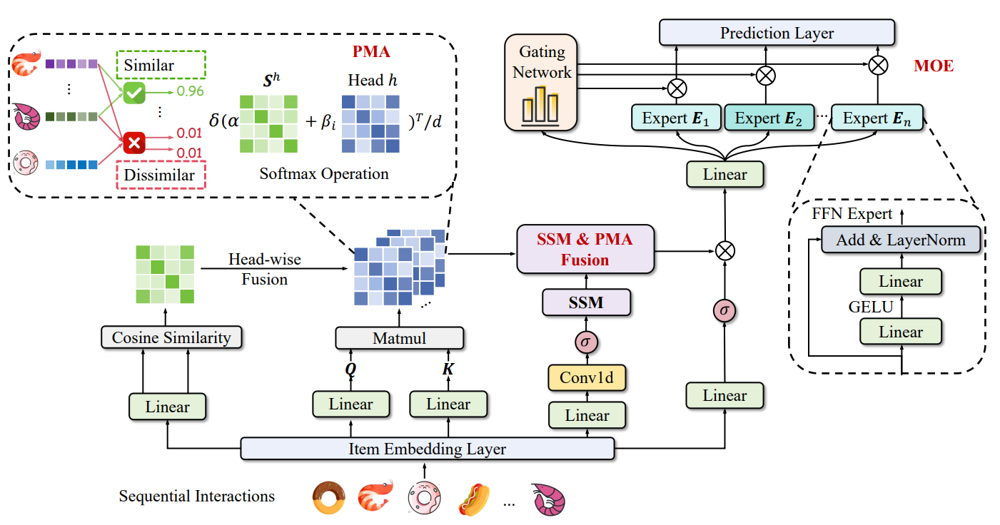
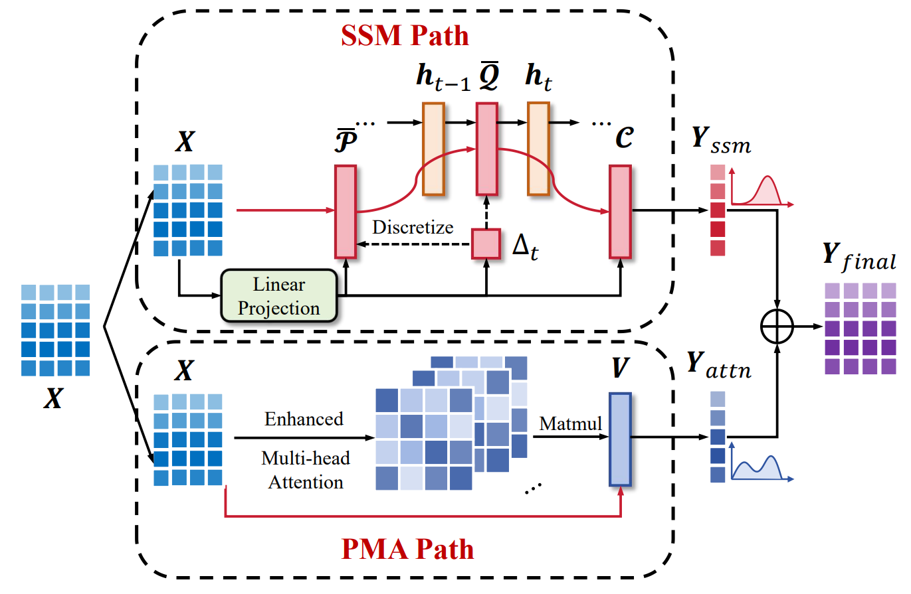

[← Back to Home](../../README.md)

<h1 align="center">STAR-Rec: Making Peace with Length Variance and Pattern Diversity in Sequential Recommendation</h1>

---

## Paper Information

| Field | Value |
|---|---|
| Title | STAR-Rec: Making Peace with Length Variance and Pattern Diversity in Sequential Recommendation |
| Venue | SIGIR |
| Year | 2025 |
| Topic | Sequential recommendation, state-space modeling, preference-aware attention, mixture-of-experts routing |
| Paper | [arXiv:2505.03484v1](https://arxiv.org/abs/2505.03484v1) |
| Asset Type | Method figures |

---

## Asset Preview Gallery

<table>
  <tr>
    <th>Method Figures</th>
    <th>Result Figures</th>
    <th>Table Figures</th>
  </tr>
  <tr>
    <td align="center">
       
      STAR-Rec Overall Architecture
    </td>
    <td align="center">
      No result figures provided
    </td>
    <td align="center">
      No table figures provided
    </td>
  </tr>
  <tr>
    <td align="center">
       
      SSM and PMA Fusion Module
    </td>
    <td align="center">
    </td>
    <td align="center">
    </td>
  </tr>
</table>

---

# 1. Method Figures

## Figure 1: STAR-Rec Overall Architecture

  

| Asset | Link |
|---|---|
| Preview Image | [image1.png](method_figures/image1.png) |
| PPT Source | Not available |

### Color Palette

| Role | Swatch | Color | Hex |
|---|---|---|---|
| Preference-aware attention similarity path |  | Green | `#72BD47` |
| Attention head interaction matrices |  | Blue | `#5778BC` |
| SSM and PMA fusion block |  | Purple | `#DCD1E9` |
| Mixture-of-experts routing branch |  | Teal | `#B8E5E4` |
| Prediction and gating layers |  | Orange | `#F5E1D4` |

---

## Figure 2: SSM and PMA Fusion Module

  

| Asset | Link |
|---|---|
| Preview Image | [image2.png](method_figures/image2.png) |
| PPT Source | Not available |

### Color Palette

| Role | Swatch | Color | Hex |
|---|---|---|---|
| Input sequence embeddings |  | Blue | `#248AC4` |
| SSM path and temporal state flow |  | Red | `#D41A3A` |
| Linear projection and control parameters |  | Green | `#E8F4D8` |
| PMA attention path |  | Blue | `#5575B8` |
| Final fused recommendation representation |  | Purple | `#8B45B5` |

---

# 2. Result Analysis Figures

No result figures were provided in `result_figures/` for this paper entry.

---

# 3. Paper Tables

No table figures were provided in `tables/` for this paper entry.
